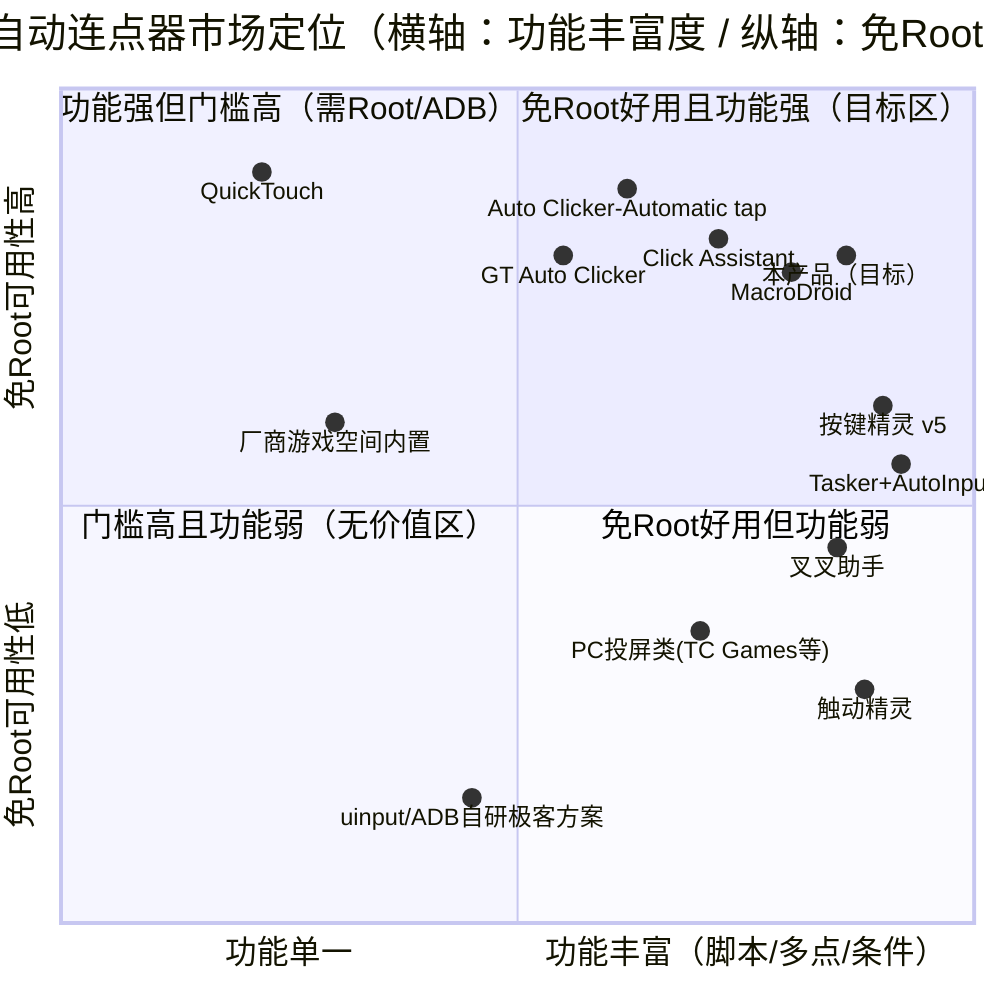
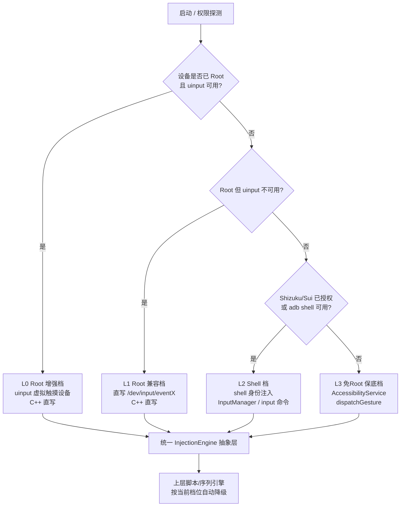
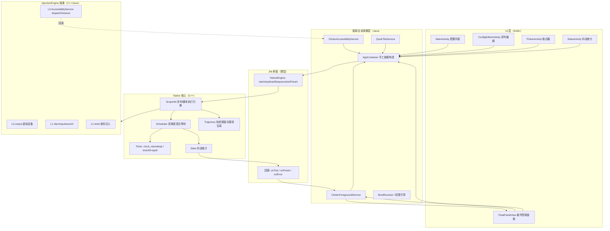

# Android 自动连点器 App — 竞品分析 / 技术调研 / 需求定义

| 项目 | 内容 |
|---|---|
| 文档版本 | v1.0 |
| 撰写角色 | 许清楚（产品经理） |
| 撰写时间 | 2026-09 |
| 项目名（建议） | `auto_clicker_android` |
| 目标平台 | **仅 Android 原生**（不做 iOS / 不做跨平台） |
| 语言分层 | 框架与生命周期 **Java**；UI **Kotlin**；延迟敏感核心 **C++ (JNI/NDK)** |
| 第一优先级 | **运行性能** |
| 交付对象 | 架构师（系统设计）→ 工程师（编码） |

> **资料可信度约定**：文中所有关键结论均附来源 URL。凡标 **`[推断]`** 者，表示未查到权威公开资料，属基于原理推断，需架构/开发阶段实测确认。

---

## 目录

- [第一部分 竞品分析](#第一部分-竞品分析)
- [第二部分 技术调研](#第二部分-技术调研)
  - [2.1 注入方式对比与分层策略](#21-注入方式对比与分层策略)
  - [2.2 高精度定时](#22-高精度定时)
  - [2.3 悬浮窗](#23-悬浮窗)
  - [2.4 无障碍服务保活与合规](#24-无障碍服务保活与合规)
  - [2.5 合规与风控红线](#25-合规与风控红线)
  - [2.6 性能基线](#26-性能基线)
- [第三部分 需求定义（PRD）](#第三部分-需求定义prd)
- [附：待确认问题](#附待确认问题)

---

# 第一部分 竞品分析

## 1.1 竞品总表

| # | 产品 | 包名 / 开发者 | 实现方式 | 最低 Android | 频率上限 / 调节粒度 | 录制回放 / 脚本 | 多点 / 多动作序列 | 是否需 Root | 商业化 | 主要吐槽点 |
|---|---|---|---|---|---|---|---|---|---|---|
| 1 | **Auto Clicker - Automatic tap** | `com.truedevelopersstudio.automatictap.autoclicker` / True Developers Studio | AccessibilityService（`canPerformGestures`）+ 悬浮控制面板 | 7.0 (API 24) | 默认 300ms/次，可调间隔；**未公开明确上限** | ✅ 支持脚本导入/导出 | ✅ 多点击点 + 多滑动（单目标 / 多目标两种模式） | ❌ 免 Root | 免费 + 广告 + IAP；100M+ 下载，评分 4.3~4.5 | 无障碍权限引导不清；高频下掉帧；部分机型服务被杀；评论区大量"如何提现"的误认投诉 [来源](https://autoclicker-true.cn.uptodown.com/android) |
| 2 | **Click Assistant** | Click Assistant（iOS/Android） | AccessibilityService + 手势录制 | 7.0+ `[推断]` | 可调 delay；主打**每次点击随机化半径/间隔/时长** | ✅ 手势录制 + 配置保存 | ✅ 多指、捏合（pinch）、曲线滑动 | ❌ 免 Root | 免费 + VIP 订阅 | 随机化牺牲精度；高级功能需 VIP；耗电与发热明显 [来源](https://myclickspeed.com/best-auto-clickers-for-android) |
| 3 | **QuickTouch** | QuickTouch | AccessibilityService，单目标极简 | **5.0+** | 单一间隔 | ❌ 无录制 | ❌ 仅单目标，无滑动/手势 | ❌ 免 Root | 免费 | 功能过窄，无法做多点和滑动 [来源](https://myclickspeed.com/best-auto-clickers-for-android) |
| 4 | **GT Auto Clicker** | GT Auto Clicker | AccessibilityService | 7.0+ | 可调 | ✅ Record Mode 手势录制 | ✅ 边缘点击模式（Edge Click Mode） | ❌ 免 Root | 免费 + IAP | 无图像识别；多 App 自动化能力弱 [来源](https://myclickspeed.com/best-auto-clickers-for-android) |
| 5 | **MacroDroid** | `com.arlosoft.macrodroid` / ArloSoft | AccessibilityService + 设备自动化平台（非专用连点器） | 各版本 | 由宏逻辑决定 | ✅ 宏（Trigger/Action/Constraint） | ✅ 70+ 触发器 / 100+ 动作 | ❌ 免 Root | 免费限 5 个宏，一次性买断解锁 | 免费版宏数量硬限制；配置耗时长；对纯连点场景"过重" [来源](https://myclickspeed.com/best-auto-clickers-for-android) |
| 6 | **Tasker + AutoInput** | `net.dinglisch.android.taskerm` / joaomgcd | AccessibilityService（AutoInput 插件） | 各版本 | 由 Profile/Task 决定 | ✅ 完整脚本与条件逻辑 | ✅ UI 查询 + 文本输入 + 按钮点击 | ❌ 免 Root（部分动作需 Root/ADB） | Tasker 付费买断 + AutoInput 订阅 | UI 老旧、学习曲线陡、中文翻译差；息屏下定时任务不稳定 [来源](https://www.cnblogs.com/aicuixia/p/19728480) |
| 7 | **按键精灵（手机版）** | 按键精灵（anjian.com） | **双模式**：Root 模式（早期 `/dev/input/event*` 注入）+ **无障碍模式（v5.0 新增）** | 无障碍模式需 **Android 7.0+**；客户端 ≥ v5.0.0；**已适配到 Android 15** | 官方承认"无 Root 环境下触摸函数执行效率**略低于** Root 模式" | ✅ QMacro/Lua 脚本 + 图色识别 + OCR(ocrEx) | ✅ 图色、多点、条件、多线程子线程 | Root 为可选增强 | 免费 + 云机调试订购 + 插件付费 | 无障碍服务会自动关闭（需手动重开 + 锁定后台）；免 Root 下部分命令不支持；脚本生态收费 [来源1](https://m.anjian.com/article_90.shtml) [来源2](https://bbs.anjian.com/showtopic-674239.aspx) |
| 8 | **触动精灵** | 触动精灵 | Root + 无障碍；早期以 `/dev/input/event*` 写入为主 | 未查到权威值 `[推断]` 7.0+ | 高 | ✅ Lua 脚本（多点找色、图形识别、内存读取） | ✅ | 完整功能需 Root | 脚本/授权付费 | 需 Root 门槛高；新机型适配慢 [来源](https://dun.163.com/news/p/561f6e8e3dfb49cc867dded5b6885e1a) |
| 9 | **叉叉助手** | `com.xxassistant` / 海南飞趣、广州游顺 | 悬浮窗 + AccessibilityService（免 Root）；早期含 Hook/改内存 | 通用模式 5.0+ | 未公开 | ✅ 可视化脚本编辑器 + 脚本商城 | ✅ | ❌ 免 Root（极客模式可 Root） | 脚本商城日/周/年/永久卡 + "原力值"虚拟货币 | **2017 被工信部责令下架**（强行捆绑推广）；**2019 净网行动被查处**（涉案超亿，60 万+脚本，抓 70 余人）；2020 年被腾讯以不正当竞争起诉**判赔 1000 万** [来源1](https://baike.baidu.com/item/叉叉助手/13020565) [来源2](https://www.xdkb.net/rd/45126) |
| 10 | **Auto.js / 其他开源方案** | `org.autojs.autojs` 等 | AccessibilityService + JS 运行时 | 7.0+ | 由脚本决定 | ✅ JS | ✅ | ❌ 免 Root | 开源 / 捐赠 | 新版 Android 上无障碍服务难启用；官方版本停更/合规风险高 [来源](https://ask.csdn.net/questions/9185509) |
| 11 | **RepetiTouch / Button Mapper / 物理按键映射类** | — | 多为 AccessibilityService 或 adb 授权 `InputManager` 注入 | 7.0+ | — | ✅ 录制回放 | 按键→触摸映射 | 部分需 ADB | 买断 / 订阅 | 需要一次性 ADB 授权，重启可能失效 |
| 12 | **PC 投屏控制类（TC Games / MuMu 等）** | — | PC 端投屏 + 键鼠映射回写（走 adb/USB 通道） | — | 高 | ✅ 录制 | ✅ | 需 PC | 买断 / 订阅 | 必须连 PC，非真机离线方案 [来源](http://www.wuduz.com/html/chuanqi/jishuwenzhang/84195.html) |
| 13 | **厂商游戏空间内置"自动点击"** | 小米/华为/OPPO/vivo 系统内置 | 系统签名，走系统输入通道 | 随 ROM | 受厂商限制 | 部分支持 | 有限 | 系统级（第三方不可达） | 免费 | 仅覆盖少数游戏、功能极简、无脚本 |

## 1.2 关键洞察

1. **免 Root + AccessibilityService 已是行业绝对主流**。包括老牌 Root 工具（按键精灵）都在 v5.0 补齐无障碍模式，说明**免 Root 是获客底线，Root 是性能增强项**。
2. **频率上限宣传普遍虚标**。市面常见"1–1000 次/秒"的宣传缺乏可验证依据；真实瓶颈在 `dispatchGesture` 的单手势串行 + 系统输入队列（见 §2.6）。
3. **"防检测随机化"是付费点**（Click Assistant），但该能力直接指向游戏作弊场景，属**高危功能**，本产品不建议提供（见 §2.5）。
4. **脚本/录制回放是中高端分水岭**：低端产品只做"单点定时点击"，中高端做"多点序列 + 录制回放 + 条件逻辑"。
5. **耗电与后台被杀是全行业共同差评点**，这是本产品可以拉开差距的地方（悬浮窗 + 前台服务 + C++ 低功耗调度循环）。

## 1.3 市场定位象限图



---

# 第二部分 技术调研

## 2.1 注入方式对比与分层策略

### 2.1.1 方案 A：AccessibilityService.dispatchGesture()（API 24+）

**能力边界（AOSP 源码硬编码）**：

| 限制项 | 数值 | 来源 |
|---|---|---|
| 单手势最大笔画数 `MAX_STROKE_COUNT` | **10**（即最多 10 指并发） | [AOSP GestureDescription.java (8.1)](https://xrefandroid.com/android-8.1.0_r81/xref/frameworks/base/core/java/android/accessibilityservice/GestureDescription.java) |
| 单手势最大持续时长 `MAX_GESTURE_DURATION_MS` | **60,000 ms（60 秒）** | 同上；[官方 API 参考](https://developer.android.com/reference/kotlin/android/accessibilityservice/GestureDescription) |
| 手势路径采样步长 | **16 ms**（`MotionEventGenerator.getGestureStepsFromGestureDescription(gesture, 16)`） | [源码分析](https://juejin.cn/post/7102099720851423246) |

**关键行为约束**：

- 必须在 `res/xml/accessibility_service_config.xml` 中声明 `android:canPerformGestures="true"`，否则 `dispatchGesture` 直接失败。[来源](https://developer.android.com/guide/topics/ui/accessibility/service)
- **同一时刻只允许一个手势在执行**；新的 `dispatchGesture` 会**取消**系统当前所有正在进行的手势（包括用户真实触摸）。[来源](https://blog.csdn.net/oo7890/article/details/153555277)
- 因此"高频连续点击"只能用 **onCompleted 回调 → 再发下一个** 的串行链，天然存在一次跨进程往返开销。
- 连续手势（长按后拖动）用 `StrokeDescription(path, startTime, duration, willContinue=true)` + `continueStroke()`，仅 **API 26+** 支持；API 24/25 需要用"来回移动 5 像素"的 hack 绕开"不移动会立即 onCompleted"的 bug。[来源](https://blog.csdn.net/weimingjue/article/details/82744146)
- 注入链路：`AccessibilityService.dispatchGesture() → IAccessibilityServiceConnection.dispatchGesture() → AccessibilityServiceConnection.dispatchGesture() → MotionEventInjector.injectEvents() → 输入事件流`。`MotionEventInjector` 除 `injectEvents` 外**所有方法只能在主线程调用**。[来源](https://juejin.cn/post/7102099720851423246)
- **可被检测**：Android 12 (API 31) 起系统在无障碍注入的事件上打 `MotionEvent.FLAG_IS_ACCESSIBILITY_TOOL`，App 可据此识别。[来源](https://www.yinkoshield.com/knowledge-center/mobile-runtime-attacks/accessibility-service-abuse)

**结论**：`dispatchGesture` 是**唯一对所有免 Root 三方 App 稳定可用**的注入通道，但它是**串行、异步回调驱动、16ms 采样**的，不适合做高频点击的"精度基准"。

### 2.1.2 方案 B：InputManager.injectInputEvent() / Instrumentation（隐藏 API）

- `InputManager.injectInputEvent(InputEvent, int mode)` 是 `@hide` API，可通过反射调用：[SO 讨论](https://stackoverflow.com/questions/18699614/android-inputmanager-injectinputevent)
- **权限是硬门槛**：native 层 `injectInputEvent` 会校验调用方 PID/UID，需要 `Manifest.permission.INJECT_EVENTS`（`signature|privileged` 级别，仅系统签名或 `/system/priv-app` 可获得）。第三方 App 声明也无效，直接 SecurityException。[来源](https://stackoverflow.com/questions/33442649/accessing-event-input-nodes-in-android-withour-rooting)
- **反射可行性**：能反射到方法，但**非系统 App 一定被权限校验挡住**。Android 9 (API 28) 起非 SDK 接口限制名单逐版本收紧，反射 `@hide` API 在 Android 12/13/14 上有被阻断或未来失效的风险。[来源：Android 14 non-SDK 限制](https://dev.mi.com/xiaomihyperos/documentation/detail?pId=1718)
- **`INJECT_INPUT_EVENT_MODE_*` 差异**（`[推断]` + 公开用法）：`MODE_ASYNC` 不等待事件被消费，吞吐高、无法确认结果；`MODE_WAIT_FOR_FINISH` 同步等待完成，延迟可测但吞吐低；`MODE_WAIT_FOR_RESULT` 需关心返回值。
- **真正可行的路径**：**以 `shell`(2000) 或 `root`(0) 身份执行**，此时不需要 `INJECT_EVENTS`。scrcpy 的 Server 端、TouchMapper 都采用这一模式——把 Java class 打进 APK，通过 `adb shell app_process` 启动一个独立进程来注入。[来源1](https://blog.csdn.net/weixin_42543046/article/details/162452369) [来源2](https://github.com/Shyri/TouchMapper/wiki/Developer-Guide)

### 2.1.3 方案 C：Root 直写 `/dev/input/eventX`（sendevent 原理）

- Linux 为每个输入设备暴露 `/dev/input/eventX`，直接 `write()` 写入 `struct input_event` 即可注入，绕过 Android 权限模型。
- **三重门槛**：
  1. 文件权限默认 **660**（owner/group 可读写），需 `su -c chmod 666 /dev/input/event*`；[来源](https://www.pocketmagic.net/?p=2640)
  2. **SELinux**：Android 5.0 起全面 enforcing，节点标签通常是 `u:object_r:input_device:s0`，App 域无权访问。需 `setenforce 0` 或用 SuperSU `supolicy --live "allow appdomain input_device chr_file { ioctl read write getattr lock append open }"`；[来源](https://stackoverflow.com/a/28682856)
  3. **设备号不确定**：触摸屏对应哪个 eventX 各机型不同，需要初始化探测（`getevent -p` 枚举 + 按 name/ABS 能力识别）。[来源](https://developer.aliyun.com/article/20548)
- **优点**：延迟最低、不经过 system_server、无 16ms 采样限制、可做多指（Protocol B 的 `ABS_MT_SLOT`）。
- **缺点**：Root 门槛；SELinux 处理在 Android 10+ 越来越难；厂商内核差异大（`[推断]`：部分新机即使 root 也因 `neverallow` 规则无法放行）。

### 2.1.4 方案 D：Shizuku / Sui（ADB 授权）

- 原理：用 ADB（Android 11+ 可**无线调试**，无需 PC）启动一个以 `shell` 身份运行的常驻服务；其他 App 通过 Binder 向它请求"以 shell 权限执行代码"。本质是"**App 自己给自己跑 adb**"。[来源](https://xda-developers.com/your-phone-can-run-adb-on-itself-with-no-pc)
- **兼容版本**：Android 7.0 起可用，Android 11+ 起体验最好（无线调试 + 配对码）。Root 设备可直接从 App 启动。[来源](https://en.todoandroid.es/Use-Shizuku-to-take-Android-customization-to-the-next-level/)
- **关键限制**：**非 Root 设备每次重启都要重新走一遍无线调试配对/启动流程**（可通过引导页降低门槛，但无法全自动）。[来源](http://shizukuapk.org/)
- **对本项目的价值**：Shizuku 提供的是 shell 身份，**shell 身份可以调用 `input` 命令 / 注入事件**（方案和 B 的 adb 路径等价），因此 Shizuku 是"免 Root 但拿到接近 Root 注入能力"的最佳中间态。
- **Sui**：Magisk 模块形态的 Shizuku 实现，Root 设备可开机自启（解决重启失效）。[来源](https://addrom.org/shizuku)

### 2.1.5 方案 E：Linux uinput（`/dev/uinput`）

- 内核模块 `uinput` 允许**用户态创建虚拟输入设备**；前提是内核开启 `CONFIG_INPUT_UINPUT`。Android 上路径通常为 `/dev/uinput`，少数厂商为 `/dev/input/uinput`。[来源](https://blog.csdn.net/d773689630/article/details/109749152)
- **必需前置**：Root 权限 + `chmod 666 /dev/uinput` + SELinux 放行（常见做法是 `setenforce 0`）。部分实现还要求 `android:sharedUserId="android.uid.system"` + 系统签名。[来源](https://blog.csdn.net/d773689630/article/details/109749152)
- **触摸设备配置要点**：必须 `ioctl(UI_SET_PROPBIT, INPUT_PROP_DIRECT)`，且 `absmin/absmax` 的 X/Y 轴范围**不能为 0**（否则报 `Touch device did not report support for X or Y axis! The device will be inoperable.`）；`ABS_MT_SLOT` absmax=9 表示最多 10 指；若被识别成鼠标需补 `/system/usr/idc/Vendor_xxxx_Product_xxxx.idc` 并写 `touch.deviceType = touchScreen`。[来源1](https://stackoverflow.com/questions/18544734/create-a-virtual-multitouch-device-using-uinput-driver) [来源2](https://blog.csdn.net/d773689630/article/details/109749152)
- **对比直写 event 节点**：
  - 优：设备是"正规"输入设备，坐标/多指语义完整，不需要猜 eventX 编号，**多指支持天然正确**；
  - 劣：多一层内核 uinput 转发，`[推断]` 单次事件延迟略高于直写 eventX；依赖 `CONFIG_INPUT_UINPUT`，部分厂商内核未开启；仍需 Root + SELinux 放行。
- **结论**：uinput 是 Root 场景下的**推荐首选**（比直写 eventX 更稳、多指更正确）；直写 eventX 作为 uinput 不可用时的降级。

### 2.1.6 分层策略建议（★核心结论）



**分层策略要点**：

- **默认档 = L3（`dispatchGesture`）**：零门槛、全机型可用，保证"装了就能用"。
- **增强档自动探测**：App 启动时依次探测 Root→uinput→eventX→Shizuku/Sui→ADB。**探测成功即升级档位，失败静默降级**，UI 只提示"当前档位"和可升级引导。
- **上层完全解耦**：所有档位暴露同一个 `injection` 接口（`tap/swipe/multiTouch/path`），脚本引擎不感知底层差异。
- **性能优先**：L0/L1 的事件生成与写入**全部在 C++ 线程内完成**，Java/Kotlin 只负责下发序列，避免 Binder 与 GC 抖动。

### 2.1.7 各档位 Android 版本可用性矩阵

| 档位 | 8.x (26/27) | 10 (29) | 12 (31/32) | 14 (34) | 15 (35) | 16 (36) | 备注 |
|---|---|---|---|---|---|---|---|
| **L3 dispatchGesture** | ✅ | ✅ | ✅ | ✅ | ✅ | ✅ | API 24+ 即可；Android 14 起目标 App 可用 `ACCESSIBILITY_DATA_PRIVATE_YES` 屏蔽，注入仍可用但"读屏"受限 |
| **L2 Shizuku / ADB** | ⚠️ 需 PC + 有线 ADB | ⚠️ 需 PC + 有线 ADB | ✅ 无线调试 | ✅ | ✅ | ✅ | Android 11+ 无线调试免 PC；**重启需重连** |
| **L1 /dev/input/eventX** | ✅ | ⚠️ SELinux 趋严 | ⚠️ 需处理 SELinux | ⚠️ | ⚠️ | ⚠️ | 主要风险在 SELinux 与厂商内核，非 Android 版本 |
| **L0 uinput** | ✅ | ⚠️ | ⚠️ | ⚠️ | ⚠️ | ⚠️ | 依赖内核 `CONFIG_INPUT_UINPUT` + SELinux 放行 |
| **B 反射 injectInputEvent（三方 App 身份）** | ❌ | ❌ | ❌ | ❌ | ❌ | ❌ | 需系统签名；**明确不可行** |

> 说明：⚠️ 表示"技术上可行但强依赖设备 Root 方案（Magisk/KernelSU）与 SELinux 状态"，`[推断]` 部分需真机矩阵实测。

---

## 2.2 高精度定时

### 2.2.1 为什么 Thread.sleep / Handler.postDelayed 不够

| 机制 | 抖动来源 | 典型量级 `[推断]` |
|---|---|---|
| `Thread.sleep(ms)` / `Object.wait` | 内核调度粒度（`CONFIG_HZ`，常见 250~1000Hz → 1~4ms 粒度）；唤醒后需等待 CPU 调度，低负载下也可能延迟数十 ms | 数 ms ~ 数十 ms |
| `Handler.postDelayed` | 额外叠加主线程消息队列排队（前面若有长任务/布局/绘制则被推迟）；Doze/后台限制下会被对齐窗口合并 | 十几 ms ~ 上百 ms |
| 两者共有 | **ART GC 停顿**（并发 GC 一般 <5ms，但前台 GC 可达 10ms+）；CPU 频率调节（governor 切换）；大小核迁移；后台进程 cgroup 限流 | 叠加 |

> 关键点：`Thread.sleep(1)` 在普通 `SCHED_OTHER` 线程上**无法保证 1ms**，它的语义是"至少睡 1ms"。

### 2.2.2 可选高精度机制对比

| 机制 | 精度 | 抖动 | 功耗 | 是否需特权 | 适用建议 |
|---|---|---|---|---|---|
| `Thread.sleep` / `Handler.postDelayed` | ms 级 | 高 | 低 | 否 | ❌ 不用于核心循环 |
| `System.nanoTime()` **纯忙等/自旋** | 纳秒级可达 | 极低（受抢占影响） | **极高**（100% 占核） | 否 | ⚠️ 仅用于 <1ms 的"尾段补偿" |
| **`clock_nanosleep(CLOCK_MONOTONIC, TIMER_ABSTIME, ...)`** | 纳秒接口，依赖 `CONFIG_HIGH_RES_TIMERS` | 低（几十 μs ~ 百 μs） | 低（真睡） | 否 | ✅ **首选主循环**（绝对时间，无累积漂移） |
| **`timerfd_create` + `TFD_TIMER_ABSTIME` + `epoll_wait`** | 同上 | 低 | 低 | 否 | ✅ **首选**（可与 eventfd/uinput fd 统一进 epoll，单线程同时等"定时 + 写入就绪"） |
| POSIX `timer_create` + `SIGEV_THREAD` | 同上 | 低，但**每次到期新建线程**开销大 | 中 | 否 | ⚠️ 不推荐（线程创建抖动）；`SIGEV_THREAD_ID` 更好但复杂 |
| `Choreographer` / VSYNC 回调 | 绑定屏幕刷新（16.67ms @60Hz） | 与显示对齐，但粒度粗（60/90/120Hz 决定） | 低 | 否 | ⚠️ 仅用于"需要跟帧对齐"的场景（如滑动轨迹） |
| `sched_setaffinity` 绑核 | — | 降低跨核迁移抖动 | — | 否 | ✅ 建议：绑定到**大核** |
| `SCHED_FIFO` / `SCHED_RR` | — | 显著降低调度延迟 | — | **需 root 或 `CAP_SYS_NICE`** | ✅ 仅在 Root 档启用 |
| `mlockall(MCL_CURRENT\|MCL_FUTURE)` | — | 消除缺页中断抖动 | — | 需权限 | ✅ 可选（Root 档） |
| CPU governor 锁 performance | — | 消除变频抖动 | **高** | 需 root | ⚠️ 不推荐（移动端耗电过高） |

**权威依据**：
- POSIX timers / `clock_nanosleep` / `timerfd` 的用法与差异：[kernel-internals.org](https://kernel-internals.org/time/posix-timers)
- 高精度定时优化手段（`SCHED_FIFO`、`sched_setaffinity`、`mlockall`、绝对时间避免漂移）：[LinuxVox](https://linuxvox.com/blog/linux-need-accurate-program-timing-scheduler-wake-up-program/)
- 内核需 `CONFIG_HIGH_RES_TIMERS=y`；默认内核首次触发延迟 1ms~10ms，启用高精度定时器后 1μs~100μs：[helloeuler.cn](http://helloeuler.cn/posts/fe4347a8.html)

### 2.2.3 NDK C++ 层推荐实现（★核心结论）

**混合等待策略（Hybrid Wait）**——兼顾精度与功耗：

```
进入下一次触发前的剩余时间 = T_remaining

if T_remaining > SPIN_THRESHOLD (建议 1.5~2.0 ms):
        clock_nanosleep(CLOCK_MONOTONIC, TIMER_ABSTIME, &next_abs_deadline, NULL)
        // 或 epoll_wait(timerfd) —— 若循环还需等 uinput/eventfd
        // 内核在 deadline 唤醒我们，此期间 CPU 可休眠 → 省电
else:
        do {
            now = clock_gettime(CLOCK_MONOTONIC);
            // 可选：__builtin_ia32_pause() / ARM yield 降低自旋功耗
        } while (now < next_abs_deadline);
        // 仅最后 <2ms 自旋，把内核唤醒抖动（几十μs~几ms）磨掉
```

**关键实现要点**（交给架构师/工程师）：

1. **绝对时间推进，杜绝漂移**：维护 `next_deadline`，每次 `next_deadline += period_ns`，**不要**用 `now + period`（会累积处理耗时误差）。若落后超过 1 个周期，按 `ceil((now - next)/period)` 跳步补上并上报"丢帧/漏拍"计数。
2. **时钟源**：`CLOCK_MONOTONIC`（不受 NTP 调整影响）；需要衡量真实耗时用 `CLOCK_MONOTONIC_RAW`。
3. **线程配置**：核心调度线程单独 `pthread_create`，`sched_setaffinity` 绑**大核**；Root 档尝试 `SCHED_FIFO`（priority 50~70，避免 90+ 抢占系统关键线程），失败则退回默认策略并降级提示。
4. **统一事件循环**：推荐 `epoll` 同时监听 `timerfd` + `eventfd`（停止信号）+ uinput/eventX 的 fd，单线程完成"定时 + 收令 + 写入"，避免多线程唤醒开销。
5. **避免自旋烧电的硬约束**：
   - `SPIN_THRESHOLD` 可配置，默认 2ms，且**仅当间隔 < 50ms 时允许自旋**（长间隔一律 sleep）；
   - 提供"**精度优先 / 均衡 / 省电优先**"三档预设：省电档 `SPIN_THRESHOLD = 0`（永不自旋）；
   - 一个序列执行完主动进入 epoll 阻塞态（不空转）；
   - 记录 `实际周期 vs 目标周期` 的 P50/P95/P99 抖动并暴露给 UI（作为"性能"卖点）。
6. **JNI 边界最小化**：序列（时间点 + 坐标 + 动作类型）一次性由 Kotlin/Java 传入 C++（建议用 `DirectByteBuffer` 或 `long[]` 扁平数组 + 预分配对象池），C++ 内部循环**零 JNI 回调**，只在"序列结束 / 出错 / 心跳"时回调。

---

## 2.3 悬浮窗

### 2.3.1 窗口类型与权限

| 项 | 说明 | 来源 |
|---|---|---|
| `TYPE_PHONE` / `TYPE_SYSTEM_ALERT` | Android 8.0 (API 26) 起**废弃**，行为不稳定 | [参考](https://xckevin.com/en/blog/android-overlay-window-permissions) |
| `TYPE_APPLICATION_OVERLAY` | **API 26+ 唯一合法的第三方全局悬浮窗类型** | [官方](https://developer.android.google.cn/reference/kotlin/android/view/WindowManager.LayoutParams) |
| `TYPE_ACCESSIBILITY_OVERLAY` | 无障碍服务专用；**属于"受信任窗口"**，不受 Android 12 不可信触摸限制 | [官方](https://developer.android.google.cn/reference/kotlin/android/view/WindowManager.LayoutParams)；[案例](https://juejin.cn/post/7335463274620600370) |
| 权限 | `SYSTEM_ALERT_WINDOW`，`PROTECTION_FLAG_PRIVILEGED` 特殊权限，**不能**用 `requestPermissions()` 申请 | [参考](https://ask.csdn.net/questions/9879918) |
| 检测 | `Settings.canDrawOverlays(context)`（API 23+） | 同上 |
| 授权跳转 | `Intent(Settings.ACTION_MANAGE_OVERLAY_PERMISSION, Uri.parse("package:$pkg"))`，建议加 `FLAG_ACTIVITY_NEW_TASK` | 同上 |

### 2.3.2 关键 Flag

| Flag | 作用 | 是否采用 |
|---|---|---|
| `FLAG_NOT_FOCUSABLE` | 永不获取输入焦点，按键事件透传给下层；隐含启用 `FLAG_NOT_TOUCH_MODAL`；同时窗口会置于输入法之上 | ✅ 必选 |
| `FLAG_NOT_TOUCH_MODAL` | 窗口**区域外**的触摸事件透传给下层 | ✅ 必选（收起态） |
| `FLAG_NOT_TOUCHABLE` | 窗口**完全不接收**触摸，区域内也穿透 | ⚠️ 仅"透明穿透模式"使用（如取点器遮罩） |
| `FLAG_WATCH_OUTSIDE_TOUCH` | 配合 `FLAG_NOT_TOUCH_MODAL` 监听区域外 DOWN 事件（实现"点外部收起"） | ✅ 建议 |
| `FLAG_LAYOUT_NO_LIMITS` | 允许窗口超出屏幕边界（配合 gravity/offset 拖动） | ✅ 建议 |
| `FLAG_HARDWARE_ACCELERATED` | 硬件加速合成，降低拖动掉帧 | ✅ 建议 |

### 2.3.3 ★ Android 12+ 触摸穿透新限制（重要）

Android 12 (API 31) 起，带 `FLAG_NOT_TOUCHABLE` 的窗口若要让触摸"穿透到下层窗口"，必须满足以下**任一**条件，否则系统**直接丢弃**该触摸事件：

1. **同 UID**：窗口与接收触摸的窗口同 UID；
2. **受信任窗口**：无障碍窗口（`TYPE_ACCESSIBILITY_OVERLAY`）、IME、Google Assistant 等——**注意 `TYPE_APPLICATION_OVERLAY` 明确不属于受信任窗口**；
3. **不可见窗口**：根 View 为 `GONE` / `INVISIBLE`；
4. **全透明**：`LayoutParams.alpha == 0`；
5. **足够半透明的 SAW 窗口**：类型为 `TYPE_APPLICATION_OVERLAY`、且 `alpha <= 最大遮挡不透明度`、且是**该 UID 在触摸路径上唯一**的 `TYPE_APPLICATION_OVERLAY` 窗口；
6. **多个 SAW 窗口组合不透明度** <= 最大遮挡不透明度，计算式：`opacity({A,B}) = 1 - (1-opacity(A))*(1-opacity(B))`。

**最大遮挡不透明度 = 0.8**；可通过 `android.hardware.input.InputManager#getMaximumObscuringOpacityForTouch()` 动态获取（**不要硬编码**）。

失败时 logcat 会打印：
```
InputDispatcher: Untrusted touch due to occlusion by <pkg> (obscuring opacity = 1.00, maximum allowed = 0.80)
InputDispatcher: Dropping untrusted touch event due to <pkg>
```
调试期可用 `adb shell am compat disable BLOCK_UNTRUSTED_TOUCHES <pkg>` 临时放开。

来源：[官方 WindowManager.LayoutParams](https://developer.android.google.cn/reference/kotlin/android/view/WindowManager.LayoutParams)、[Android 12 行为变更](https://developer.android.google.cn/about/versions/12/behavior-changes-all#untrusted-touch-events)、[InputDispatcher 源码分析](https://cloud.tencent.com/developer/article/2368014)

> **对本项目的直接影响**：悬浮控制面板本身**必须可点击**，因此走 `FLAG_NOT_FOCUSABLE + FLAG_NOT_TOUCH_MODAL`（面板区域自己消费事件，区域外透传）——这条路径**不受** Android 12 限制。只有在"取点器全屏遮罩需要穿透"时才需要处理：此时建议**改用 `TYPE_ACCESSIBILITY_OVERLAY`**（无障碍服务窗口天然受信任），比"把 alpha 压到 0.8"更可靠且不影响视觉。

### 2.3.4 拖动/点击/不拦截底层触摸的实现要点

- **拖动 vs 点击判定**：自己实现 `OnTouchListener`，`ACTION_DOWN` 记录 `rawX/rawY` 与 `params.x/params.y`；`ACTION_MOVE` 中计算偏移并更新；`ACTION_UP` 时若总位移 < 阈值（建议 `ViewConfiguration.get(context).scaledTouchSlop`）且时长 < 300ms 则判定为点击。**不要**依赖 `OnClickListener`（会被拖动误触发）。
- **避免 `updateViewLayout` 高频刷新的性能问题**：`updateViewLayout()` 会触发一次 WindowManager 的跨进程 layout 事务，60Hz 下逐帧调用开销明显。建议：
  1. 拖动时**只在 `ACTION_MOVE` 且位移 >= 1px 时**调用；
  2. 用 `Choreographer` 或时间戳**节流到每帧最多一次**；
  3. **更优方案**：悬浮窗用 `FLAG_LAYOUT_NO_LIMITS` + 固定 `WRAP_CONTENT` 根布局，拖动时**直接改 View 自身的 `translationX/translationY`**（纯 RenderThread 属性动画，零跨进程调用），松手时才用一次 `updateViewLayout` 把最终位置写回 `params.x/params.y` 并重置 translation。
- **区域穿透**：`dispatchTouchEvent` 中判断坐标是否落在可点击区域，不在则 `return false`；**注意**部分 ROM 即使设了 `FLAG_NOT_TOUCHABLE` 仍会消费 DOWN，此时需显式 `onTouchEvent` 返回 `false`。且切换 flag 后必须 `updateViewLayout()`，**绝不能**在 `ACTION_MOVE` 里频繁切换。[来源](https://xckevin.com/en/blog/android-overlay-window-permissions)
- **后台启动限制**：Android 11+ 禁止后台进程直接 `addView`。悬浮窗的 attach 应放在 **ForegroundService 内**或 Activity `onResume`，避免在 `Application#onCreate` 里做。

### 2.3.5 各厂商额外限制与跳转

| 厂商 / ROM | 已知限制 | 建议 Intent（失败则 fallback 系统标准页） |
|---|---|---|
| **小米 MIUI / HyperOS** | 需单独开"显示悬浮窗"；`canDrawOverlays()` 可能延迟生效（建议跳转后延时 ~1.5s 二次校验）；还需关"神隐模式"、在开发者选项开"USB 调试（安全设置）" | `miui.intent.action.APP_PERM_EDITOR` + `extra_pkgname`；或 `com.miui.securitycenter/.permcenter.permissions.PermissionsActivity` / `.homewidget.HWPermissionManagerActivity`（MIUI ≥12.5） |
| **华为 EMUI / HarmonyOS** | 部分版本需重启进程才生效；后台易被杀 | `com.huawei.systemmanager/.addviewmonitor.AddViewMonitorActivity`；fallback `com.huawei.permissionmanager/.permission.singleapp.PermissionsActivity` 或 `com.huawei.systemmanager.permission.PermissionAppManager` + `packageName` |
| **OPPO / 一加 ColorOS** | 部分机型直接禁止第三方悬浮窗，`canDrawOverlays()` 返回 false 但实际可用 | 标准 Intent + **用 `AppOpsManager.checkOpNoThrow(OP_SYSTEM_ALERT_WINDOW, uid, pkg)` 二次校验** |
| **vivo / iQOO OriginOS / Funtouch** | 同上，误判最多 | 同上（`checkOpNoThrow` 二次校验）+ 手动引导文案 |
| **三星 OneUI** | 相对标准 | 标准 `ACTION_MANAGE_OVERLAY_PERMISSION` 即可 |

来源：[CSDN 适配问答](https://ask.csdn.net/questions/9879918)、[CSDN 适配问答 2](https://ask.csdn.net/questions/9636719)、[xckevin 实战](https://xckevin.com/en/blog/android-overlay-window-permissions)

---

## 2.4 无障碍服务保活与合规

### 2.4.1 服务被杀/自动关闭的常见原因

| 原因 | 机制 | 应对 |
|---|---|---|
| **厂商后台限制 / 一键清理** | 国产 ROM（ColorOS/OriginOS/MIUI）激进清理；应用被清理 ≈ force-stop | 引导用户：自启动 + 电池优化白名单 + 多任务锁定 |
| **省电策略 / Doze / App Standby** | 被省电策略停止 ≈ force-stop | 引导加入电池优化白名单 |
| **force-stop** | **无障碍服务会从启用列表中被自动移除**（这是硬机制） | 只能检测 + 引导重开 |
| **进程崩溃** | AOSP 原生会通过 `BIND_AUTO_CREATE` 自动重启（`scheduleServiceRestartLocked`，首次 1s，重试间隔递增、次数受限） | 保证服务自身稳定；但**多数定制系统禁止自启**，导致重启失败 |
| **侧载应用受限（Android 13+）** | 非应用商店安装（非 session-based install）的 App，其无障碍开关被"受限设置"拦截，用户需在 App Info → 允许受限设置 | 分发走应用商店；若侧载需给出明确指引 |

来源：[无障碍服务保活探究（含 AOSP 源码路径）](https://github.com/5ec1cff/my-notes/blob/master/keep-accessibility-service-alive.md)、[厂商策略指南](https://tsight.io/articles/10947042)

### 2.4.2 检测存活与引导

- **检测**：`AccessibilityManager.getEnabledAccessibilityServiceList(AccessibilityServiceInfo.FEEDBACK_ALL_MASK)` 中是否包含自身组件名；更底层可 `adb shell dumpsys accessibility` 看 `mEnabledServices` 与 Service state（`binding` / `crashed` 表示链路已断）。
- **兜底二次校验**：读 `Settings.Secure.ENABLED_ACCESSIBILITY_SERVICES`（读取**无需权限**，任何 App 都可读）。
- **程序化开启**：写 `Settings.Secure.ENABLED_ACCESSIBILITY_SERVICES` 需要 `WRITE_SECURE_SETTINGS`（`signature|privileged`，普通三方 App 拿不到），只能通过 `pm grant` 或 adb/root 授予。**因此 App 内只能引导用户手动开启**，UI 必须提供"一键跳设置页 + 分步图文指引"。
- **心跳自检**：前台服务每隔 N 秒自检一次，发现服务掉线则发通知 + 悬浮窗变灰提示"点此恢复"。
- 注意：**不要**反复把自己的服务从列表移除再添加（会导致反复 bind、onServiceConnected 后仍加不上无障碍窗口而崩溃）。[来源](https://github.com/5ec1cff/my-notes/blob/master/keep-accessibility-service-alive.md)

### 2.4.3 Android 13 / 14 / 15 新增强制要求

| 版本 | 强制项 | 影响 |
|---|---|---|
| **Android 12 (31)** | `isAccessibilityTool` 属性；只有真正面向残障用户的工具才能声明，且豁免 Play 的显著披露/同意要求 | 声明需谨慎，虚假声明会被 Play 拒审 |
| **Android 13 (33)** | `POST_NOTIFICATIONS` 运行时权限（默认拒绝）；侧载 App 的无障碍服务需"允许受限设置" | 必须在首次启动引导申请通知权限，否则前台服务通知不可见 |
| **Android 14 (34)** | **前台服务类型（FGS type）强制声明**：除 `FOREGROUND_SERVICE` 外，还必须按类型声明对应权限（如 `FOREGROUND_SERVICE_SPECIAL_USE`）；`startForeground()` 类型不匹配直接抛 `SecurityException`；继续收紧 non-SDK 接口；`ACCESSIBILITY_DATA_PRIVATE_YES` 让 App 可屏蔽非无障碍工具的读屏 | Manifest 必须声明 `android:foregroundServiceType` + 对应权限 |
| **Google Play（2026-08-31 起）** | 新应用/更新必须 **targetSdk ≥ 36（Android 16）**；存量应用需 targetSdk ≥ 35 | **本项目 targetSdk 定 36** |

来源：[Android 14 FGS 类型表（荣耀适配指南）](https://developer.honor.com/cn/docs/adaptation_guide/guides/google_u_compatibility_adaptation_guide)、[POST_NOTIFICATIONS](https://awakewiki.org/permissions/normal/post-notifications)、[Android 14 无障碍安全特性](https://www.androidpolice.com/android-14-beta-1-accessibility-malware/)、[Play target API 要求](https://support.google.com/googleplay/android-developer/answer/11926878?hl=zh-Hant)、[API Levels](https://apilevels.com/)

> **FGS type 选型建议**：本产品不属于 camera/location/mediaPlayback 等既有类型，应使用 **`specialUse`**（Manifest 声明 `<uses-permission android:name="android.permission.FOREGROUND_SERVICE_SPECIAL_USE"/>` + `android:foregroundServiceType="specialUse"`，并提供 `<property android:name="android.app.PROPERTY_SPECIAL_USE_FGS_SUBTYPE"` 说明）。注意 Play 对 `specialUse` 有人工审核，需准备充分说明。`[推断]`：需在 Play 声明表如实填写用途。

---

## 2.5 合规与风控红线

### 2.5.1 Google Play 政策（★上架风险最高项）

- **政策原文精神**：`AccessibilityService` / `BIND_ACCESSIBILITY_SERVICE` **只能用于帮助残障用户使用 Android 设备和应用**；不得用于改变用户设置、绕过 Android 内置隐私控制与通知、或以欺骗性方式利用 UI。
- **2023 年起的执法**：Google 向使用无障碍 API 的开发者发邮件，要求 30 天内说明"该 API 如何帮助残障用户"，无法说服即**下架**；且"所有违规都会被记录，严重或重复违规将导致开发者账号及关联 Google 账号被终止"。[来源1](https://umatechnology.org/google-will-remove-apps-that-misuse-accessibility-services-from-play-store) [来源2](https://gadgetstouseae.pages.dev/posts/google-will-remove-apps-that-misuse-accessibility-services-from-play-store)
- **真实拒审案例**：某"自动卸载多个 App"的应用因使用 Accessibility API 被拒，官方明确回复"卸载 App 不是 Accessibility API 支持的用途"。[来源](https://support.google.com/googleplay/android-developer/thread/214347913)
- **2024/2025 持续收紧**：Android 14 API 限制 + Play 审核期主动复核无障碍声明，无清晰合法用途即拒。[来源](https://www.appsrethink.com/blog/android-accessibility-service-guide)

> **上架风险结论**：
> **本产品若以"自动连点 / 游戏连点 / 挂机刷副本"为主要卖点，上架 Google Play 的拒审/下架风险为「极高」，且存在开发者账号连带封禁风险。**
> 即使包装为"无障碍辅助"，只要应用名、截图、描述、关键词中出现游戏/连点/刷金币等表述，仍会被判定为非残障用途。

### 2.5.2 中国大陆监管

- **工信部《关于进一步提升移动互联网应用服务能力的通知》（工信部信管函〔2023〕26 号）**：要求权限"**最小必要**"、"在对应业务功能启动时动态申请所需权限，不得一揽子同意"、"调用敏感权限时同步告知目的"、"严格 APP 上架审核 + 强化在架巡查"。[来源](https://www.ncsti.gov.cn/zcfg/zcwj/202303/t20230302_109809.html)
- **工信部《促进数字技术适老化高质量发展工作方案》（工信部信管〔2023〕251 号）**：无障碍被定位为**适老化/残障辅助**方向，与"自动化外挂"是相反的政策导向。[来源](http://wza.isc.org.cn/jszc/gzdt/20240724/3523.html)
- **国内应用商店**：华为/小米/OPPO/vivo 等对无障碍权限普遍要求**单独显著披露 + 用途说明 + 隐私政策列明**，部分商店直接不收"连点器"品类。

### 2.5.3 游戏外挂的法律风险（★最高危）

| 风险类型 | 依据 / 判例 | 后果 |
|---|---|---|
| **刑事：提供侵入、非法控制计算机信息系统程序、工具罪** | 《刑法》第 285 条第 3 款；两高解释：违法所得 **≥ 2.5 万元**或造成经济损失 ≥ 5 万元即"情节特别严重"，处 **3 年以上 7 年以下有期徒刑，并处罚金** | 上海杨浦案：销售游戏外挂 10 万余元 → 有期徒刑 3 年、缓刑 3 年、罚金 3 万 [来源](https://www.shyp.gov.cn/shypq/xwzx-bmdt/20260325/502287.html)；鹰潭"全国首例 AI 外挂案"：获利 629 万 → 有期徒刑 3 年、缓刑 5 年 [来源](https://yujiang.jxfy.gov.cn/article/detail/2024/05/id/7927532.shtml)；南宁案：获利 472 万 → 3 人获刑 [来源](http://www.nanning.jcy.gov.cn/yasf/202208/t20220819_3802718.shtml) |
| **民事：不正当竞争** | 《反不正当竞争法》 | **腾讯诉叉叉助手案**：法院认定运行脚本扰乱游戏正常秩序、损害经营者与消费者合法权益，构成不正当竞争，**判赔 1000 万元** [来源](https://baike.baidu.com/item/叉叉助手/13020565) |
| **行政 / 专项打击** | 2019"净网"专项行动：全国首例"聚合脚本外挂平台"案，叉叉助手被查处，抓 70 余人、查获脚本 60 万余个、涉案超亿元，平台下架整改 [来源](https://www.xdkb.net/rd/45126)；2017 年叉叉助手已因强行捆绑推广被工信部责令下架 [来源](https://baike.baidu.com/item/叉叉助手/13020565) | 下架、罚款、平台关停 |

### 2.5.4 产品化合规建议（★必须执行）

1. **明确定位表述**：产品定位为「**无障碍辅助 / UI 自动化测试 / 重复操作提效工具**」，应用名、商店描述、截图、关键词中**禁止**出现：连点、挂机、刷金币、打怪、代肝、防封、防检测、无敌、秒杀、游戏加速、抢红包、秒杀等词。
2. **首次启动强制弹窗**：显式告知无障碍权限用途（"仅用于在您主动触发时，代替您重复执行点击/滑动操作"）、声明**不采集屏幕内容/不上报数据**、并要求用户勾选确认。
3. **内置免责声明 + 用户协议**，明确：
   - 不得用于任何违反第三方应用/游戏用户协议或法律法规的场景；
   - 不得用于游戏作弊、刷量、薅羊毛、抢购/抢单等破坏公平性的行为；
   - 因用户违规使用产生的一切后果由用户自行承担。
4. **功能层面主动切割**：
   - **不提供**"防检测随机化 / 模拟真人轨迹 / 反封号"类功能（这是 Click Assistant 的付费点，也是明确指向作弊的证据）；
   - **不内置**任何具体游戏的脚本模板/脚本商城；
   - **不提供**"后台静默自动启动脚本"作为默认能力（所有执行需用户显式点击开始）。
5. **隐私最小化**：不申请通讯录/位置/相册/录音；不上报任何屏幕内容；无障碍服务配置中，非必要不开启 `canRetrieveWindowContent`（若仅做坐标点击则**只声明 `canPerformGestures`**，把权限面降到最小——这一点对过审帮助很大）。

### 2.5.5 建议的分发策略（★结论）

| 渠道 | 建议 | 理由 |
|---|---|---|
| **Google Play** | ❌ **不建议作为主渠道**；若要上架，必须以"无障碍辅助/自动化辅助"形态、去除一切游戏暗示，并准备无障碍声明材料 | 拒审 + 账号连带封禁风险 |
| **国内主流应用商店** | ⚠️ 谨慎；需按各商店要求提供权限用途说明与软件著作权，品类风险仍高 | 无障碍权限监管趋严 |
| **GitHub / 开源仓库 Release** | ✅ **推荐主渠道**（如采用开源协议） | 开发者/测试受众精准，合规压力最小，且利于建立口碑 |
| **自建官网 / F-Droid** | ✅ 推荐 | 自主可控 |
| **企业内部分发 / 测试分发** | ✅ 推荐（面向"UI 自动化测试"场景） | 场景合规 |

> **总体分发结论**：**走"开源 / 官网自分发 + 开发者向"路线，明确"UI 自动化测试与无障碍辅助"定位，规避游戏脚本定位。** 产品内所有文案与功能都不得出现诱导游戏作弊的内容。

---

## 2.6 性能基线

| 指标 | 结论 | 可信度 |
|---|---|---|
| 宣传的"1–1000 次/秒" | **不可信**。免 Root 走 `dispatchGesture` 时，单次手势必须经过 `App → Binder → system_server → MotionEventInjector → 输入队列`，且**同时只允许一个手势**（新手势会取消旧手势），因此只能"回调驱动串行"。真机可持续频率远低于 1000/s | 高（机制推导）+ 需实测 |
| `dispatchGesture` 单次往返延迟量级 | `[推断]` 常见 **10~50ms**；受 system_server 负载、主线程排队、回调投递 Handler 影响 | **需实测**（列为 P0 验收项） |
| 手势**内部**时间分辨率 | **16ms**（AOSP 采样步长 `getGestureStepsFromGestureDescription(gesture, 16)`） | 高（源码） |
| 免 Root 可持续点击频率 `[推断]` | 稳定 **10~30 次/秒**（回调驱动串行）；用"一次手势内塞多个点击事件"的方式可显著更高，但受 16ms 采样步长限制 | 需实测 |
| Root/uinput 可持续点击频率 `[推断]` | 可达 **数百次/秒**，瓶颈转移到内核 input 队列与目标 App 主线程处理速度 | 需实测 |
| 影响精度的主要因素 | ① 注入通道（跨进程次数）；② 定时器抖动（GC / 调度 / 变频）；③ 目标 App 主线程是否被绘制/布局占满；④ 屏幕刷新率（60/90/120Hz）；⑤ 省电策略与后台限流；⑥ 悬浮窗是否频繁 `updateViewLayout` 抢占主线程 | 高 |

> **给工程师的硬性要求**：架构阶段必须建立一个 **BenchmarkActivity**，对上述指标在 **免Root / Shell / Root 三档 × 低端机 / 旗舰机** 组合下实测，用 P50/P95/P99 抖动作为验收数据，回填本文档。

---

# 第三部分 需求定义（PRD）

## 3.1 项目信息

| 项 | 值 |
|---|---|
| Language | 中文 |
| Project Name | `auto_clicker_android` |
| Programming Language | 框架/生命周期 **Java**；UI **Kotlin**；核心延迟敏感逻辑 **C++ (JNI/NDK)** |
| 平台 | 仅 Android 原生 |
| 原始需求复述 | 做一个 Android 原生自动连点器 App。一切以运行性能为最高优先级；框架与生命周期用 Java，UI 用 Kotlin，点击调度循环/高精度定时器/坐标轨迹计算/手势路径插值/脚本执行引擎等计算密集与延迟敏感的核心逻辑用 C++ 经 JNI/NDK 实现；不引入跨平台框架或额外中间层（不用 Flutter/React Native/Unity/Cordova，不引入重量级 DI 框架或事件总线）；用户通过悬浮窗操作；功能一步到位、不做占位，完整可用。 |

## 3.2 产品定义

**一句话产品目标**

> 一款**以运行性能为第一优先级**的 Android 原生自动连点/手势自动化工具：以悬浮窗为唯一主交互入口，用 C++/NDK 实现微秒级抖动的调度与轨迹引擎，并提供"免 Root 保底 + Root 增强"的多档注入能力，**明确定位为无障碍辅助与 UI 自动化测试工具**。

**Product Goals（3 个正交目标）**

| # | 目标 | 可度量标准 |
|---|---|---|
| G1 | **精度**：把点击/手势的时间抖动压到极限 | 在旗舰机上，间隔 ≥ 50ms 时周期抖动 **P95 ≤ ±2ms**；间隔 ≥ 500ms 时 **P95 ≤ ±5ms**（需在 Root/Shell 档达成；免 Root 档以实测值为准放宽） |
| G2 | **性能与功耗平衡**：高频下不掉帧、不烧电 | 100 次/秒连点持续 10 分钟：主 UI 线程无 ANR、帧率 ≥ 50fps；CPU 占用在"均衡"档下 ≤ 15%（单大核） |
| G3 | **覆盖与可用**：零门槛可用，有权限自动增强 | 免 Root 档在 Android 8~16 上 100% 可启动；Root 设备自动识别并升级到增强档，用户零配置 |

## 3.3 目标用户与使用场景（合规场景）

| 用户 | 场景 |
|---|---|
| **无障碍需求用户** | 因肢体活动受限难以长时间/高频重复点击屏幕，需要以悬浮窗一键启动代替重复操作 |
| **App 测试工程师 / 开发者** | UI 回归测试、压力点击测试、Monkey 式遍历、需要精确控制点击间隔与轨迹的自动化用例 |
| **重复操作提效用户** | 表单批量填写后的重复提交、相册批量操作、内容批量收藏/整理等**非游戏、非薅羊毛**的重复点击场景 |

> **明确排除的场景**（产品文案与功能设计均不得诱导）：网络游戏中自动挂机/刷副本/代肝/抢资源；电商/社交平台的抢购、秒杀、刷量、刷赞、自动化养号；任何以获取不正当利益为目的的批量自动化行为。

## 3.4 用户故事

1. 作为**肢体活动受限的用户**，我希望在任意界面通过悬浮窗一键启动预设的点击，以便减少重复点击带来的负担。
2. 作为**测试工程师**，我希望把点击间隔精确到毫秒并看到实际执行的时间抖动统计，以便验证 App 在高频点击下的稳定性。
3. 作为**测试工程师**，我希望录制一段真实手势（点击+滑动+多指）并原样回放 N 次，以便复现复杂的操作路径。
4. 作为**普通用户**，我希望用取点器从当前屏幕直接"点选"目标控件的中心，而不用手输坐标，以便快速配置。
5. 作为**普通用户**，我希望配置可以绑定到一个具体 App（包名），切换到该 App 时自动加载对应配置，以便不用每次重选。
6. 作为**高级用户**，我希望在 Root 设备上自动启用更高性能的注入通道，以便获得更高的点击频率和更低的抖动。
7. 作为**高级用户**，我希望用 Quick Settings 磁贴或音量键在锁屏/全屏场景下快速启停，以便不用先呼出悬浮窗。
8. 作为**所有用户**，我希望在权限被系统回收时能被明确告知并一键跳到对应设置页，以便快速恢复而不是"莫名其妙不工作"。

## 3.5 需求池

### 模块一：目标平台与运行环境

| ID | 优先级 | 需求 |
|---|---|---|
| P0 | **P0** | `minSdk = 24`（Android 7.0，覆盖 `dispatchGesture` 且兼容主流）；`targetSdk = 36`（Android 16，满足 Play 2026-08-31 新规），`compileSdk = 36` |
| P0 | **P0** | **不使用任何跨平台框架**（Flutter/RN/Unity/Cordova 一律禁止）；不引入 DI 框架（Dagger/Hilt/Koin）、不引入事件总线（EventBus）；依赖注入用手工构造 + 单一 `AppContainer`，跨模块通信用显式接口回调 |
| P0 | **P0** | **语言分层强制**：`AccessibilityService`、前台服务、`Application`、`TileService`、广播等**框架/生命周期**代码用 **Java**；所有 **Activity/Fragment/Compose 或 View 的 UI** 代码用 **Kotlin**；调度循环、定时器、轨迹插值、手势路径生成、脚本执行引擎用 **C++** |
| P0 | **P0** | **Ability/Permission 边界矩阵**（必须实现并在 UI 展示"当前档位"）：<br/>• **L3 免Root 保底**：`AccessibilityService(canPerformGestures)` → 点击/滑动/长按/多指/全局动作，频率受限<br/>• **L2 Shell 档**：Shizuku/Sui/ADB → 接近 Root 的注入能力，重启需重连<br/>• **L1 Root 兼容**：直写 `/dev/input/eventX`<br/>• **L0 Root 增强**：uinput 虚拟设备<br/>降级矩阵：探测失败自动降级，功能不缺失、仅"频率/精度上限"下降；UI 明示当前档位与可升级路径 |
| P0 | **P0** | 权限申请流程：悬浮窗（`ACTION_MANAGE_OVERLAY_PERMISSION` + 厂商适配 + `AppOpsManager` 二次校验）、无障碍（跳 `ACTION_ACCESSIBILITY_SETTINGS` + 分步图文指引）、通知（Android 13+ `POST_NOTIFICATIONS`） |
| P1 | P1 | 厂商适配表（MIUI/HyperOS、EMUI/HarmonyOS、ColorOS、OriginOS、OneUI）：跳转 Intent + 电池优化白名单引导 + 自启动引导 |
| P1 | P1 | Android 14 前台服务：`android:foregroundServiceType="specialUse"` + `FOREGROUND_SERVICE_SPECIAL_USE` 权限 + subtype property |
| P2 | P2 | 无障碍服务存活心跳自检（前台服务 15s 一次），掉线时通知 + 悬浮窗置灰 + 一键跳恢复 |

### 模块二：核心功能需求

**① 点击频率与精度**

| ID | 优先级 | 需求 |
|---|---|---|
| P0 | **P0** | 频率范围：**1 次/小时 ~ 200 次/秒**（内部统一为纳秒周期，上限按档位动态调整：L3 档软上限 30/s 并提示，L0/L1 档可到 200/s） |
| P0 | **P0** | **调节粒度 1 ms**（UI 步进 1ms；C++ 内部用纳秒，支持 <1ms 的高级手动输入） |
| P0 | **P0** | 精度指标（验收）：Root/Shell 档，间隔 50ms 时 P95 ≤ ±2ms；间隔 ≥500ms 时 P95 ≤ ±5ms。免 Root 档以实测回填 |
| P0 | **P0** | C++ 层实现**混合等待**：`clock_nanosleep(TIMER_ABSTIME)`（或 `timerfd`+`epoll`）+ 尾段（<2ms）自旋；绝对时间推进不累积漂移；`SPIN_THRESHOLD` 可配置 |
| P0 | **P0** | 三档功耗预设：**精度优先 / 均衡 / 省电**（省电档永不自旋） |
| P1 | P1 | 抖动统计面板：实时显示 P50/P95/P99 周期误差与漏拍计数 |

**② 坐标与界面元素位置设置**

| ID | 优先级 | 需求 |
|---|---|---|
| P0 | **P0** | **绝对坐标**（px）与**屏幕百分比**（0–100%，跨分辨率/横竖屏自动换算）两种模式，必选其一或按比例混合 |
| P0 | **P0** | **取点器**：全屏半透明遮罩 + 十字准星 + 坐标实时显示，支持拖动微调与"确定/取消"；遮罩优先用 `TYPE_ACCESSIBILITY_OVERLAY`（规避 Android 12 不可信触摸限制） |
| P0 | **P0** | **基于 AccessibilityNodeInfo 的控件查找与相对定位**：按 文本 / `viewIdResourceName` / `className` / `contentDescription` 查找；命中后取控件中心；支持"相对偏移"（控件中心 ±dx, ±dy）与"未命中时的降级策略"（等待/跳过/终止） |
| P0 | **P0** | **多点与序列**：支持 N 个动作的有序序列；每个动作类型 = 点击 / 长按（可配时长）/ 滑动（起点终点+时长+插值曲线）/ 多指手势（≤10 指）/ 等待 / 全局动作（返回/主页/最近任务/通知栏）/ 条件判断（P1）；每点可独立设置间隔、重复次数、按下时长 |
| P1 | P1 | 滑动轨迹插值：**直线 / 贝塞尔 / 缓动（ease-in-out）/ 人手模拟曲线**，采样步长可配（默认 8ms），由 C++ 在路径生成阶段完成 |
| P1 | P1 | 配置绑定到 App 包名：切换到目标 App 自动提示加载对应配置 |
| P2 | P2 | 图色识别（截图 + 找色/找图）作为控件查找的补充手段（需 `MediaProjection`，注意权限与合规） |

**③ 热键与触发机制**

| ID | 优先级 | 需求 |
|---|---|---|
| P0 | **P0** | **悬浮窗按钮**（主入口）：播放/暂停/停止、切换配置、打开主界面、收起为小球 |
| P0 | **P0** | **通知栏常驻控制**（播放/暂停/停止 Action 按钮） |
| P1 | P1 | **Quick Settings 磁贴**（`TileService`，API 24+，Android 13+ 用 `requestAddTileService()` 引导添加）：一键启停 + 状态回显 |
| P1 | P1 | **音量键触发**：仅在前台服务运行且用户主动开启时生效。实现限制说明：Android 普通 App **无法**在后台可靠监听音量键（`KEYCODE_VOLUME_UP/DOWN` 不会派发给非前台 App），可行路径为无障碍服务 `flagRequestFilterKeyEvents`（需服务配置开启）+ `onKeyEvent`，或仅在前台 Activity 中拦截。**必须在 UI 明示"该功能部分机型受限"** |
| P2 | P2 | 摇一摇触发（注意：工信部 2023 年 26 号文明令禁止"高灵敏度摇一摇"诱导操作，**仅作为用户显式开启的可选触发方式，且灵敏度必须可调到很低**） |
| P2 | P2 | 无障碍"无障碍按钮"（`flagRequestAccessibilityButton`）/ 指纹手势（API 29+，仅限部分机型） |

**④ 循环与次数控制**

| ID | 优先级 | 需求 |
|---|---|---|
| P0 | **P0** | 循环策略：**无限循环 / 固定次数 / 固定时长 / 直到手动停止** 四种，可组合（如"最多 1000 次或 5 分钟，先到先停"） |
| P0 | **P0** | 序列级与全局级双层循环控制（序列内部可循环，整体也可循环） |
| P0 | **P0** | 条件终止：超时保护、目标控件消失、屏幕关闭自动暂停（可配） |
| P0 | **P0** | **紧急停止**：悬浮窗 STOP + 通知 STOP + 磁贴 STOP + 音量下键连按（若启用）；停止响应 ≤ 100ms |
| P1 | P1 | 随机抖动：仅提供"**均匀随机化间隔**"（用于避免固定周期造成的系统/目标 App 判定异常），**默认关闭**；**禁止**命名为"防检测/防封号"，**禁止**与游戏场景绑定 |
| P1 | P1 | 执行日志与统计：起止时间、执行次数、平均间隔、抖动 P95、失败/取消次数，可导出 CSV（用于自动化测试报告） |
| P2 | P2 | 定时/计划任务启动（需处理 Doze 与精确闹钟权限） |

### 模块三：整体技术实现思路（简述，详细架构由架构师出）



**要点**：
1. **JNI 边界最小化**：Kotlin/Java 只在"开始/停止/装载序列/改参数"时穿越 JNI；执行期间 C++ 内部闭环，**不在每次点击做 JNI 回调**（仅每 N 次或每 200ms 心跳回传一次统计）。
2. **数据传递零拷贝**：序列用预分配的 `DirectByteBuffer`（C++ 侧 `GetDirectBufferAddress`）或扁平 `long[]`；C++ 侧预分配对象池，**执行循环内禁止 new/malloc**。
3. **InjectionEngine 单一抽象**：`tap / longPress / swipe / multiTouch / path / globalAction`，四档实现可插拔，运行时按探测结果注入。
4. **无中间层**：不引入 DI 与事件总线；模块间用显式接口 + 回调；状态用单一 `StateStore`（Java）+ 观察者列表（手写，非框架）。
5. **无障碍服务配置最小化**：仅做坐标注入时**只声明 `canPerformGestures = true`**；`canRetrieveWindowContent` 仅在用户使用"控件查找"功能时按需通过 `setServiceInfo()` 动态开启（降低权限面、利于合规与过审）。

### 模块四：排期（简述，详细由架构师出）

| 阶段 | 内容 | 建议工期 `[推断]` |
|---|---|---|
| M1 骨架与验证 | NDK 工程骨架、Java/Kotlin/C++ 分层、Benchmark 精度实测、注入档位可行性验证 | 1.5 周 |
| M2 核心引擎 | C++ 调度器 + 定时器 + 序列引擎 + InjectionEngine 四档 | 3 周 |
| M3 交互层 | 悬浮窗（拖动/点击/穿透/厂商适配）、主界面、配置编辑、取点器 | 2.5 周 |
| M4 权限与保活 | 权限引导流、前台服务、TileService、心跳自检、厂商白名单引导 | 1.5 周 |
| M5 打磨与合规 | 抖动统计面板、日志导出、合规文案/免责声明、真机矩阵测试 | 2 周 |
| **合计** | | **约 10.5 周（1 名 Android + 1 名 C++ 并行）** |

## 3.6 UI 设计稿建议

### 3.6.1 主界面（配置列表）

```
┌─────────────────────────────────────────┐
│  ⚙  自动连点器            [档位: Root增强] [?]│  ← 顶栏：设置 / 当前注入档位徽章 / 帮助
├─────────────────────────────────────────┤
│  ┌───────────────────────────────────┐  │
│  │ 权限状态卡片                        │  │
│  │  ✅ 悬浮窗   ✅ 无障碍   ✅ 通知     │  │
│  │  ⚠ 未加入电池优化白名单  [去设置]    │  │
│  └───────────────────────────────────┘  │
├─────────────────────────────────────────┤
│  我的配置                        [+ 新建] │
│  ┌───────────────────────────────────┐  │
│  │ ▶ 表单批量提交        12 步 · 200ms │  │
│  │   📱 com.example.form      [更多⋮]  │  │
│  ├───────────────────────────────────┤  │
│  │ ▶ 压测-100次每秒       1 步 · 10ms  │  │
│  │   📱 任意应用               [更多⋮]  │  │
│  ├───────────────────────────────────┤  │
│  │ ▶ 手势回放-登录流程    8 步 · 录制   │  │
│  │   📱 com.example.app       [更多⋮]  │  │
│  └───────────────────────────────────┘  │
├─────────────────────────────────────────┤
│   [🏠 配置]   [📊 统计]   [🎬 录制]   [⚙ 设置]│  ← BottomNav
└─────────────────────────────────────────┘
```

### 3.6.2 悬浮控制面板

**展开态（可拖动，边缘自动吸附）：**

```
              ┌──────────────────────────┐
              │ ⣿  表单批量提交        ⌄  │  ← 顶部条：长按拖动 / ⌄ 收起
              ├──────────────────────────┤
              │  ▶ 开始    ⏸ 暂停    ⏹ 停止│
              ├──────────────────────────┤
              │  间隔  200 ms   [−][+]    │
              │  次数  ∞        [−][+]    │
              │  进度  128 / ∞            │
              ├──────────────────────────┤
              │  📊 抖动 P95: ±1.8 ms     │
              │  ⚡ 档位: Root增强         │
              └──────────────────────────┘
```

**收起态：** 一个 56dp 半透明圆形悬浮球（显示当前状态色：灰=停止/绿=运行/黄=暂停），点击展开。

**实现要点**：`FLAG_NOT_FOCUSABLE | FLAG_NOT_TOUCH_MODAL | FLAG_WATCH_OUTSIDE_TOUCH | FLAG_LAYOUT_NO_LIMITS | FLAG_HARDWARE_ACCELERATED`；拖动用 `translationX/Y` 逐帧更新，松手才 `updateViewLayout` 落位；位移 < `touchSlop` 判定为点击。

### 3.6.3 取点器

```
┌─────────────────────────────────────────┐  ← 全屏 TYPE_ACCESSIBILITY_OVERLAY 遮罩
│                                         │     （受信任窗口，规避 Android 12 限制）
│         (540, 1280)                     │
│            │                            │
│      ──────╬───────                     │  ← 十字准星，跟随手指
│            │                            │
│            ●  ← 当前选中点               │
│                                         │
│  ┌───────────────────────────────────┐  │
│  │ X  540        Y  1280              │  │
│  │ 百分比: 50.0% / 59.3%              │  │
│  │ 模式: [绝对坐标] [屏幕百分比]        │  │
│  │ 控件: TextView "提交"  [吸附到控件]  │  │  ← 有 AccessibilityNodeInfo 时显示
│  │         [ 取消 ]      [ 确定 ]      │  │
│  └───────────────────────────────────┘  │
└─────────────────────────────────────────┘
```

### 3.6.4 配置编辑页（序列编辑）

```
┌─────────────────────────────────────────┐
│  ←  编辑配置                    [保存]    │
├─────────────────────────────────────────┤
│  名称  [表单批量提交                    ] │
│  绑定  [com.example.form          ] [选择]│
├─────────────────────────────────────────┤
│  动作序列                                │
│  ┌───────────────────────────────────┐  │
│  │ 1 👆 点击   坐标(540,1280)  200ms  │  │
│  │     ↕ 间隔 500ms                   │  │
│  │ 2 👆 长按   控件"提交"      800ms  │  │
│  │     ↕ 间隔 1000ms                  │  │
│  │ 3 👉 滑动   (200,900)→(800,900)    │  │
│  │     时长 300ms  曲线: 缓动          │  │
│  │     ↕ 间隔 300ms                   │  │
│  │ 4 🖐 双指缩放                       │  │
│  │     ↕ 间隔 500ms                   │  │
│  └───────────────────────────────────┘  │
│   [+ 点击] [+ 长按] [+ 滑动] [+ 多指]     │
│   [+ 等待] [+ 全局动作] [+ 条件]  [🎬录制]│
├─────────────────────────────────────────┤
│  循环: ●无限 ○固定次数[   ] ○固定时长[ ] │
│  随机间隔抖动: [关] (范围 ±[  ]%)         │
│  屏幕关闭时: [自动暂停]                   │
├─────────────────────────────────────────┤
│   [ 试运行 3 次 ]      [ 保存并启动 ]      │
└─────────────────────────────────────────┘
```

---

# 附：待确认问题

| # | 问题 | 影响 | 需谁决策 |
|---|---|---|---|
| Q1 | **产品定位最终确认**：走"无障碍辅助 + UI 自动化测试"合规定位（放弃游戏场景），还是接受高风险做通用连点器？ | 决定分发渠道、功能范围、文案、是否上架 Play | 用户/团队 |
| Q2 | `minSdk` 定 24 还是 26？API 24/25 的连续手势有"必须移动 1 像素否则立即 onCompleted"的 bug，需额外 hack | 兼容性与代码复杂度 | 架构师 |
| Q3 | 是否需要"控件查找（AccessibilityNodeInfo）"能力？开启需 `canRetrieveWindowContent`，会显著扩大权限面、增加拒审风险 | 合规与功能取舍 | 用户 + 架构师 |
| Q4 | Root 增强档是否需要内置 Shizuku API 依赖（增加体积与外部依赖）？还是只提供"手动输入 adb 命令"的引导式接入？ | 依赖与体验 | 架构师 |
| Q5 | 频率硬上限定多少？（建议免 Root 30/s、Root 200/s，超出显示警告） | 稳定性与口碑 | 用户 |
| Q6 | 是否需要"图色识别/找图"？需 `MediaProjection` 截屏，增加权限面、性能开销与合规风险 | 范围与合规 | 用户 |
| Q7 | 是否开源？开源协议（建议 Apache-2.0 或 GPL-3.0）？ | 分发策略 | 用户 |
| Q8 | UI 用传统 View + XML 还是 Jetpack Compose？**注意用户要求"一切以性能为最高优先级"**：Compose 首次构建与重组有额外开销，悬浮窗场景建议用**传统 View**，主界面可用 Compose | 性能与开发效率 | 架构师 |
| Q9 | C++ 调度线程是否启用 `SCHED_FIFO`？仅 Root 档可启用，非 Root 档需评估 `CAP_SYS_NICE` 可行性 | 精度上限 | 架构师 |
| Q10 | 是否需要多语言（i18n）？ | 开发范围 | 用户 |

---

## 参考来源汇总

**竞品**
- https://autoclicker-true.cn.uptodown.com/android
- https://play.google.com/store/apps/details?id=com.truedevelopersstudio.automatictap.autoclicker （经 https://bit.ly/2zxS7Ob 跳转）
- https://myclickspeed.com/best-auto-clickers-for-android
- https://www.techbloat.com/9-best-auto-clicker-apps-for-android-ios.html
- https://m.anjian.com/article_90.shtml ；https://m.anjian.com/article_93.shtml ；https://bbs.anjian.com/showtopic-674239.aspx
- https://dun.163.com/news/p/561f6e8e3dfb49cc867dded5b6885e1a （网易易盾《模拟点击研究》）
- https://baike.baidu.com/item/叉叉助手/13020565 ；https://www.xdkb.net/rd/45126
- https://www.cnblogs.com/aicuixia/p/19728480 （MacroDroid/Tasker 对比）

**注入方式**
- https://xrefandroid.com/android-8.1.0_r81/xref/frameworks/base/core/java/android/accessibilityservice/GestureDescription.java
- https://developer.android.com/reference/kotlin/android/accessibilityservice/GestureDescription
- https://developer.android.com/guide/topics/ui/accessibility/service
- https://juejin.cn/post/7102099720851423246 （dispatchGesture 源码流程 / 16ms 采样）
- https://blog.csdn.net/weimingjue/article/details/82744146 （实战坑位）
- https://blog.csdn.net/oo7890/article/details/153555277
- https://stackoverflow.com/questions/18699614/android-inputmanager-injectinputevent
- https://stackoverflow.com/questions/33442649/accessing-event-input-nodes-in-android-withour-rooting
- https://github.com/Shyri/TouchMapper/wiki/Developer-Guide （adb app_process 注入思路）
- https://blog.csdn.net/weixin_42543046/article/details/162452369 （scrcpy 反射注入）
- https://www.pocketmagic.net/?p=2640 （/dev/input/eventX 直写，660 权限）
- https://stackoverflow.com/a/28682856 （SELinux input_device）
- https://developer.aliyun.com/article/20548 （getevent/sendevent/input）
- https://blog.csdn.net/d773689630/article/details/109749152 （uinput 实战）
- https://stackoverflow.com/questions/18544734/create-a-virtual-multitouch-device-using-uinput-driver
- https://xda-developers.com/your-phone-can-run-adb-on-itself-with-no-pc ；https://addrom.org/shizuku ；http://shizukuapk.org/ ；https://en.todoandroid.es/Use-Shizuku-to-take-Android-customization-to-the-next-level/

**高精度定时**
- https://kernel-internals.org/time/posix-timers
- https://linuxvox.com/blog/linux-need-accurate-program-timing-scheduler-wake-up-program/
- http://helloeuler.cn/posts/fe4347a8.html ；https://helloeuler.cn/posts/c44b6a3.html

**悬浮窗**
- https://developer.android.google.cn/reference/kotlin/android/view/WindowManager.LayoutParams
- https://cloud.tencent.com/developer/article/2368014 （untrusted touch 源码分析）
- https://juejin.cn/post/7335463274620600370 （Android 12 穿透失效与两种解法）
- https://xckevin.com/en/blog/android-overlay-window-permissions
- https://ask.csdn.net/questions/9879918 ；https://ask.csdn.net/questions/9636719 （厂商适配）
- https://www.cnblogs.com/breakDay/p/16608169.html

**保活与版本适配**
- https://github.com/5ec1cff/my-notes/blob/master/keep-accessibility-service-alive.md
- https://tsight.io/articles/10947042 （厂商后台策略 + dumpsys）
- https://developer.honor.com/cn/docs/adaptation_guide/guides/google_u_compatibility_adaptation_guide （Android 14 FGS 类型）
- https://awakewiki.org/permissions/normal/post-notifications
- https://dev.mi.com/xiaomihyperos/documentation/detail?pId=1718 （Android 14 适配指南）
- https://www.androidpolice.com/android-14-beta-1-accessibility-malware/ ；http://www.shoonya.io/blog/android-14-accessibility-security-feature
- https://www.yinkoshield.com/knowledge-center/mobile-runtime-attacks/accessibility-service-abuse
- https://support.google.com/googleplay/android-developer/answer/11926878?hl=zh-Hant ；https://apilevels.com/

**合规与判例**
- https://umatechnology.org/google-will-remove-apps-that-misuse-accessibility-services-from-play-store
- https://gadgetstouseae.pages.dev/posts/google-will-remove-apps-that-misuse-accessibility-services-from-play-store
- https://support.google.com/googleplay/android-developer/thread/214347913
- https://www.appsrethink.com/blog/android-accessibility-service-guide
- https://www.ncsti.gov.cn/zcfg/zcwj/202303/t20230302_109809.html （工信部 26 号文）
- http://wza.isc.org.cn/jszc/gzdt/20240724/3523.html （工信部 251 号文）
- https://www.shyp.gov.cn/shypq/xwzx-bmdt/20260325/502287.html
- https://yujiang.jxfy.gov.cn/article/detail/2024/05/id/7927532.shtml
- http://www.nanning.jcy.gov.cn/yasf/202208/t20220819_3802718.shtml
- http://jllyzy.e-court.gov.cn/article/detail/2025/04/id/8812502.shtml
- https://baike.baidu.com/item/叉叉助手/13020565 （腾讯诉叉叉助手判赔 1000 万）
