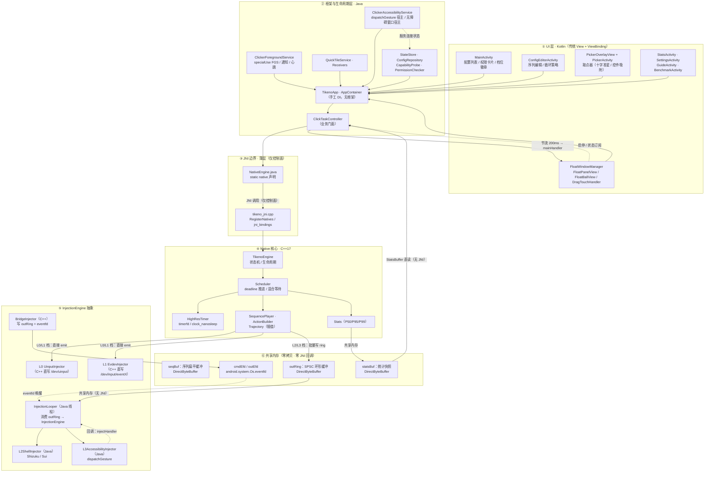
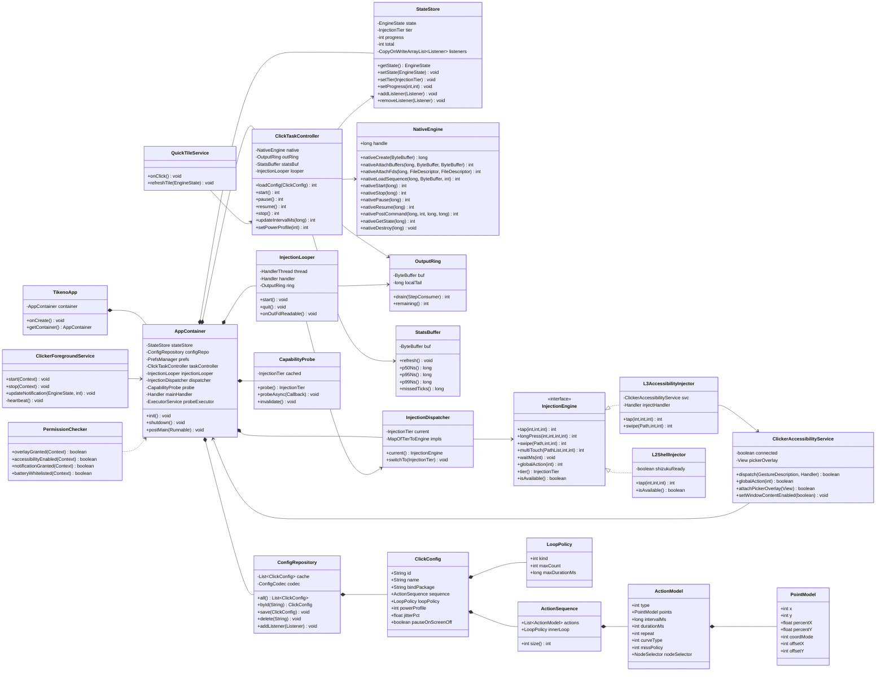
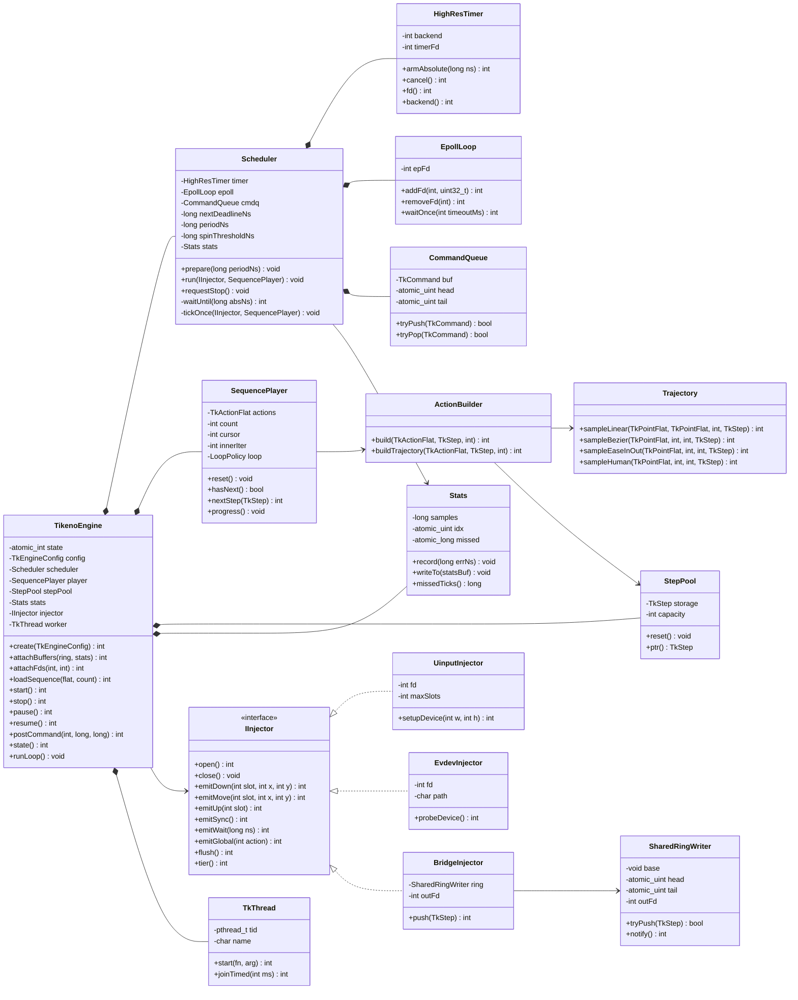
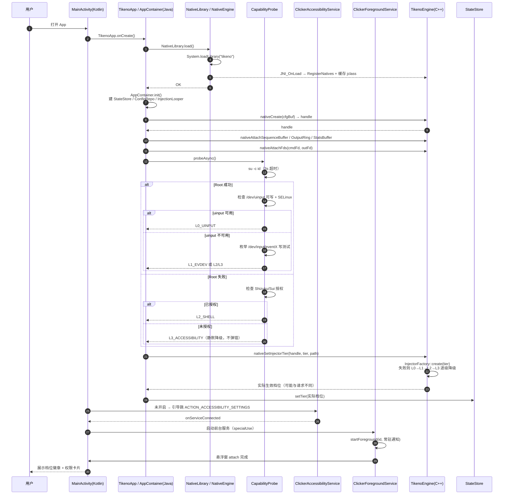
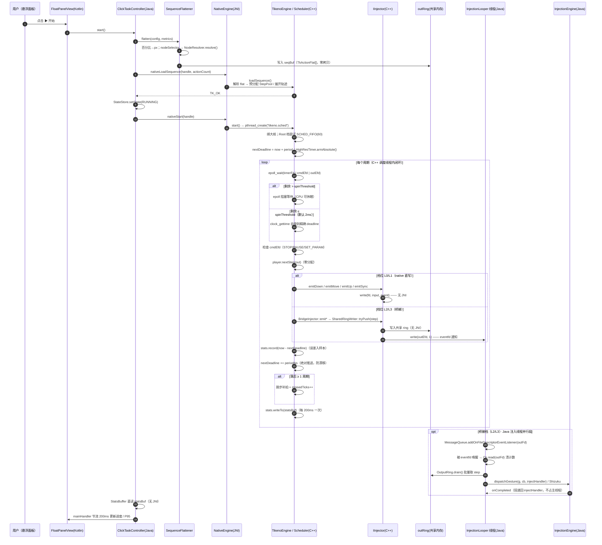
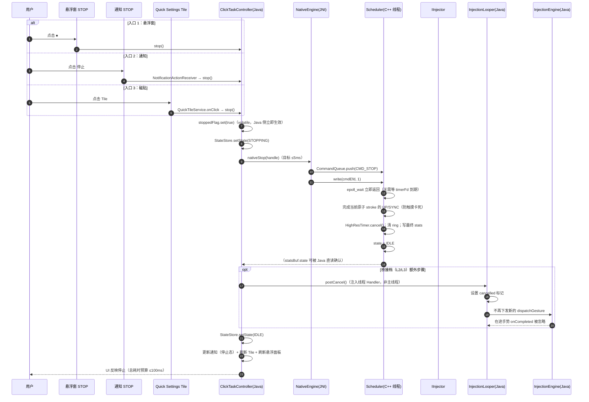
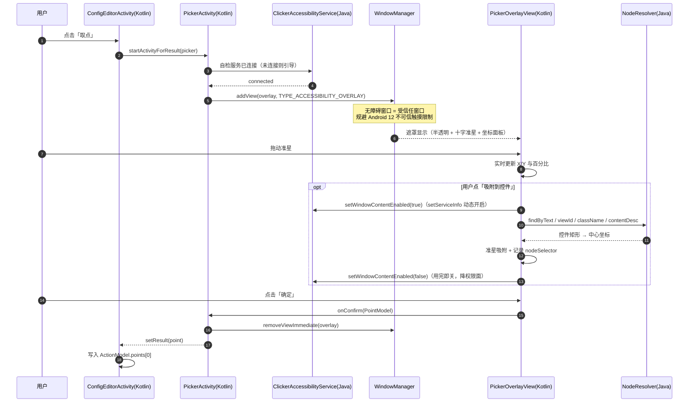
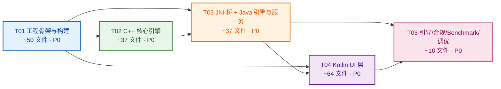

# Tikeno（Android 自动连点器）— 系统架构设计 & 任务分解

| 项目 | 内容 |
|---|---|
| 文档版本 | v1.0 |
| 撰写角色 | 高见远（架构师） |
| 项目代号 | **Tikeno** |
| applicationId | `com.tikeno.autoclicker` |
| 上游输入 | `docs/01-竞品分析与技术调研.md`（许清楚，v1.0） |
| 目标平台 | **仅 Android 原生** |
| 第一优先级 | **运行性能** |
| 语言分层 | 框架/生命周期 **Java** ｜ UI **Kotlin（传统 View + ViewBinding）** ｜ 延迟敏感核心 **C++17（JNI/NDK）** |
| 交付对象 | 工程师（编码） |

> **本文档定位**：不重复调研结论（注入分层、权限矩阵、合规红线、性能基线等一律引用 `01-竞品分析与技术调研.md` 的章节号），只做**架构决策、文件级分解、接口定义、时序与线程模型、排期**。工程师按第 2 章文件列表即可逐个文件落地。

---

## 目录

- [1. 实现方案与框架选型](#1-实现方案与框架选型)
- [2. 完整文件列表](#2-完整文件列表)
- [3. 模块分层架构图](#3-模块分层架构图)
- [4. 数据结构与接口设计](#4-数据结构与接口设计)
- [5. JNI 边界定义](#5-jni-边界定义)
- [6. 关键时序图](#6-关键时序图)
- [7. 线程模型](#7-线程模型)
- [8. 任务列表（T01–T05）](#8-任务列表t01t05)
- [9. 依赖包列表](#9-依赖包列表)
- [10. 共享知识 / 跨文件约定](#10-共享知识--跨文件约定)
- [11. 分阶段排期计划](#11-分阶段排期计划)
- [12. 待明确事项](#12-待明确事项)

---

# 1. 实现方案与框架选型

## 1.1 总体决策摘要

| 项 | 决策 | 理由（性能视角） |
|---|---|---|
| 构建系统 | Gradle **8.11.1** + AGP **8.7.3** + Kotlin **2.0.21**（Kotlin DSL `.kts`） | 三者均已在本机 Gradle 缓存中，可离线构建；AGP 8.7.3 与 Gradle 8.11.1 / JDK 21 / NDK 27 兼容矩阵已验证 |
| SDK | `compileSdk 35` / `targetSdk 35` / `minSdk 24` | 本机仅装 `android-35` 与 `build-tools 34.0.0`，必须能本地真编译（见 §12 Q-A 关于 Play targetSdk 36 的冲突） |
| NDK / CMake | NDK `27.0.12077973` / CMake `3.22.1` | 本机已装；CMake 3.22.1 恰为 AGP 8.7 默认版本，无需额外下载 |
| C++ 标准 / 优化 | **C++17**；Release `-O3 -flto=thin -DNDEBUG`；Debug `-O0 -g -DTK_DEBUG=1` | LTO 消除跨 TU 调用开销；Debug 保留符号便于 ndk-stack |
| ABI | 默认 **arm64-v8a**（`armeabi-v7a` 作为可选开关） | 性能优先；减小体积与构建时间 |
| UI 框架 | **传统 View + ViewBinding + Material Components**（**不用 Compose**） | 零额外运行时开销、无重组成本、悬浮窗场景首帧更快，符合"不引入额外中间层" |
| DI / 事件总线 | **手写 `AppContainer` + 显式接口回调** | 禁止 Dagger/Hilt/Koin/EventBus（PRD 模块一 P0） |
| JSON | 内置 `org.json` | 零第三方依赖；配置体积 KB 级，手写 `ConfigCodec` 足够 |
| 异步 | `ExecutorService` + `Handler` + `MessageQueue.OnFileDescriptorEventListener`（**不引入 Kotlin 协程**） | 避免协程调度器带来的额外线程与调度开销；线程数完全可控 |
| 注入抽象 | 统一 `IInjector`（C++）/ `InjectionEngine`（Java）双端同构，四档可插拔 | 上层不感知档位，探测失败静默降级 |

## 1.2 核心技术难点与对策

### 难点 1：C++ 内闭环 vs `dispatchGesture` 只能在 Java 调用（★架构成败点）

`AccessibilityService.dispatchGesture()` 是 **Java API**，且（调研 §2.1.1）**同一时刻只允许一个手势**、`onCompleted` 异步回调驱动。若 C++ 调度循环每步都通过 JNI 上调 Java，则：
- 违背"执行循环内零 JNI 回调"硬约束；
- 每次 upcall 触发 `AttachCurrentThread` / JNI 转换开销（μs 级 × 高频 = 不可接受）；
- ART 侧的 `GestureDescription` / `Path` 对象分配会造成 GC 抖动，直接破坏周期精度。

**对策：共享内存环形缓冲 + eventfd 通知（事件流向反转）**

```
C++ 调度线程                         Java 注入线程（tikeno.inject）
 ┌──────────────┐                     ┌──────────────────────────┐
 │ 计算 step     │                     │ epoll(eventfd) 阻塞等待    │
 │ 写入 outRing  │─── 共享内存 ───────▶│ 批量取 step                │
 │ write(outEfd) │─── eventfd ───────▶│ InjectionEngine.inject()  │
 │ (无 JNI)      │                     │ (dispatchGesture / Shizuku)│
 └──────────────┘                     └──────────────────────────┘
```

- C++ 侧**只做两件事**：写共享内存（`DirectByteBuffer` 的裸地址，初始化时缓存一次）+ 一次 `write(outEfd, &one, 8)`。**全程无 JNI 调用、无 malloc、无系统调用之外的阻塞**。
- Java 侧通过 `MessageQueue.addOnFileDescriptorEventListener(outFd, EVENT_INPUT, cb)`（API 23+ 公开 API，minSdk 24 可用）在**自己的 Looper 上**等待 eventfd，无需自建 epoll 线程。
- 单步开销：一次 `write` 系统调用 ≈ 1~2 μs，比一次 JNI upcall 低一个数量级，且不触碰 ART 堆。
- 对 **L0/L1（native 直写）** 档位，`outRing` 完全不启用 —— C++ 直接 `write(fd)`，真正的零跨语言开销。

这是本架构与"市面连点器"的本质区别，也是达成 PRD G1（P95 ≤ ±2ms）的关键。

### 难点 2：高精度定时 + 可即时响应停止

- 主等待：**`timerfd_create(CLOCK_MONOTONIC, TFD_NONBLOCK)` + `epoll_wait(epfd, ..., timeout_ms)`**，epoll 集里同时挂 `timerFd`、`cmdEfd`（停止/暂停/参数更新命令）、`outEfd`（仅 L2/L3 模式，等待 Java 侧确认）。
  - `timerfd` 使用 `TFD_TIMER_ABSTIME` 设置**绝对 deadline**，内部即内核 hrtimer，与 `clock_nanosleep(TIMER_ABSTIME)` 同源同精度；额外收益是**命令到达可立即唤醒**（紧急停止 ≪100ms）。
  - `HighResTimer` 同时封装 `kNanosleep` 后端（`clock_nanosleep`），作为 `timerfd` 不可用（`create` 失败）时的 fallback，默认 `kTimerFd`。
- 尾段补偿：`epoll_wait` 返回后，若 `remaining < spinThresholdNs`（默认 2ms，精度档 3ms / 均衡 2ms / 省电 0ms 永不自旋），进入 `clock_gettime` 自旋循环，磨掉内核唤醒抖动。
- 防漂移：`nextDeadlineNs += periodNs`（**绝不用 `now + period`**）；若落后 ≥1 周期，按 `ceil((now - next)/period)` 跳步补上并累加 `missedTicks`。
- 线程：`pthread_setname_np("tikeno.sched")`；`sched_setaffinity` 绑到大核；**仅 Root 档**尝试 `SCHED_FIFO(prio=60)`，失败则静默回退。

### 难点 3：Android 12+ 触摸限制与权限面最小化

- 悬浮控制面板本身**必须可点击** → `TYPE_APPLICATION_OVERLAY`（API 26+；API 24/25 回退 `TYPE_PHONE`）+ `FLAG_NOT_FOCUSABLE | FLAG_NOT_TOUCH_MODAL | FLAG_WATCH_OUTSIDE_TOUCH | FLAG_LAYOUT_NO_LIMITS | FLAG_HARDWARE_ACCELERATED`。此路径**不受** Android 12 不可信触摸限制。
- 取点器遮罩**必须**用 `TYPE_ACCESSIBILITY_OVERLAY`（受信任窗口）→ 只能在 `ClickerAccessibilityService` 内 `addView`，且**服务必须已连接**。
- `canRetrieveWindowContent` **默认关闭**，仅用户主动使用"控件取点/控件查找"时通过 `setServiceInfo()` 动态开启（合规 + 降权限面）。

### 难点 4：内存与线程可控

- C++ 侧：**执行循环内禁止任何堆分配**。所有容器在 `prepare()` 阶段 `reserve()` 或用定长栈数组；`std::vector` 仅允许在控制面使用。Release 构建加入 `-D TK_NO_ALLOC_ASSERT`：在热路径函数入口用 `tk::AllocGuard` 记录 `mallinfo`-like 计数（仅 Debug 生效）。
- JNI 侧：**C++ 不持有任何 `jobject` 全局引用**（因为零 upcall），从根上杜绝 JNI 引用泄漏。仅缓存 3 个 `jclass`（`NativeEngine`、`FileDescriptor`、异常类）与若干 `jfieldID`。
- Java 侧：`HandlerThread` 在 `AppContainer.shutdown()` 中 `quitSafely()`；悬浮窗在 Service `onDestroy` 中 `removeViewImmediate`；动态广播严格配对注册/注销。

---

# 2. 完整文件列表

> 约定：`app/` 为单模块应用模块根目录。共 **33 + 3 + 50 + 47 + 30 + 59 ≈ 197 个文件**（`.h`/`.cpp` 成对者按 2 个文件计）。
> 语言列：**J**=Java，**K**=Kotlin，**C++**=C++，**G**=Gradle 脚本，**X**=XML，**P**=Properties/其他。
> 编号 1–121 为源码/构建文件（部分编号行含成对的 `.h`/`.cpp` 两个文件），资源文件另行统计。

## 2.1 工程根与构建（8 个）

| # | 路径 | 语言 | 职责 |
|---|---|---|---|
| 1 | `settings.gradle.kts` | G | 声明 `include(":app")`、仓库模式（`FAIL_ON_PROJECT_REPOS`）、`google()`/`mavenCentral()` |
| 2 | `build.gradle.kts` | G | 根构建脚本：AGP 8.7.3 / Kotlin 2.0.21 插件声明（`apply false`），`clean` task |
| 3 | `gradle.properties` | P | `org.gradle.jvmargs=-Xmx4096m -XX:+HeapDumpOnOutOfMemoryError`、`android.useAndroidX=true`、`android.nonTransitiveRClass=true`、`android.enableJetifier=false`、`kotlin.code.style=official`、`org.gradle.parallel=true`、`org.gradle.caching=true`、`android.defaults.buildfeatures.buildconfig=true` |
| 4 | `gradle/wrapper/gradle-wrapper.properties` | P | `distributionUrl=.../gradle-8.11.1-bin.zip`（本机已缓存） |
| 5 | `local.properties.sample` | P | SDK 路径示例（`sdk.dir=C\:\\Users\\...\\AppData\\Local\\Android\\Sdk`），提示复制为 `local.properties` |
| 6 | `.gitignore` | P | 忽略 `.gradle/ build/ local.properties .cxx/ *.iml .idea/ captures/ .externalNativeBuild/` |
| 7 | `README.md` | — | 构建/运行/调试说明、NDK 版本要求、`ndk-stack` 用法、合规声明摘要 |
| 8 | `.github/workflows/android.yml` | X | CI：`assembleDebug` + `assembleRelease` + `lint` + `connectedCheck`（可选）+ 上传 APK/Native symbols |

## 2.2 app 模块构建（3 个）

| # | 路径 | 语言 | 职责 |
|---|---|---|---|
| 9 | `app/build.gradle.kts` | G | 插件、`namespace`/`applicationId`、SDK 版本、`ndkVersion`、`externalNativeBuild.cmake`、`buildTypes`（Release 开启 minify + LTO）、`abiFilters`、`viewBinding=true`、依赖声明 |
| 10 | `app/proguard-rules.pro` | P | 保留 native 方法与 `NativeEngine`、`FileDescriptor.descriptor` 反射字段、Shizuku、Material/AppCompat keep 规则 |
| 11 | `app/src/main/AndroidManifest.xml` | X | 全部权限、四大组件声明、前台服务 `specialUse` + `PROPERTY_SPECIAL_USE_FGS_SUBTYPE`、Shizuku Provider、FileProvider、`<queries>` |

## 2.3 C++ 核心层（33 组 · 50 个文件）

根：`app/src/main/cpp/`。凡写成 `xxx.h` / `.cpp` 的行代表 **2 个文件**。

| # | 路径 | 职责 |
|---|---|---|
| 12 | `CMakeLists.txt` | 源文件清单、`-std=c++17`、按 `CMAKE_BUILD_TYPE` 设置优化等级与 LTO、`-fno-rtti`（Release）、链接 `liblog`/`libandroid`、输出 `libtikeno.so` |
| 13 | `tikeno_jni.cpp` | `JNI_OnLoad`：`RegisterNatives` 注册全部 native 方法、缓存 `JavaVM*` 与 `jclass`/`jfieldID`、`JNI_OnUnload` 清理 |
| 14 | `jni/jni_bindings.h` | native 方法表（`JNINativeMethod[]`）与函数声明 |
| 15 | `jni/jni_bindings.cpp` | 全部 JNI 入口函数实现（薄层：参数校验 → 句柄解析 → 调 `TikenoEngine`） |
| 16 | `jni/jni_util.h` | RAII 工具：`ScopedLocalRef`、`JniEnvGuard`（`AttachCurrentThread`/`Detach`）、`GetDirectPtr()`、`FdFromJavaFileDescriptor()`、`ThrowTkError()` |
| 17 | `jni/jni_util.cpp` | `jni_util.h` 的实现（含 `FileDescriptor.descriptor` fieldID 缓存与读取） |
| 18 | `jni/handle_table.h` | 句柄表：`long handle → TikenoEngine*`（`std::unordered_map` + 共享互斥，**仅控制面**），带 magic 校验防野句柄 |
| 19 | `core/types.h` | 核心 POD：`TkActionFlat`、`TkPointFlat`、`TkStep`、`TkEngineConfig`、`TkStatsSnapshot`、全部枚举与 `TkError` 错误码（**与 Java `ErrorCodes` 一一对应**） |
| 20 | `core/constants.h` | 常量：步长、默认值、`SPIN_THRESHOLD` 三档表、频率上下限、ring 容量 |
| 21 | `core/time_util.h` | `nowNs()`（`CLOCK_MONOTONIC`）、`deadlineAdd()`、`nsToTimespec()`、跳步补拍计算（header-only，`always_inline`） |
| 22 | `core/high_res_timer.h` / `.cpp` | `HighResTimer`：双后端（`kTimerFd` / `kNanosleep`），`armAbsolute(ns)`、`cancel()`、`backend()` |
| 23 | `core/epoll_loop.h` / `.cpp` | `EpollLoop`：fd 注册/注销、`waitOnce(timeoutMs)`、事件分发 |
| 24 | `core/ring_buffer.h` | SPSC 无锁环形缓冲模板（header-only，`alignas(64)` 分离 head/tail，`acquire/release` 语义） |
| 25 | `core/shared_ring.h` / `.cpp` | `SharedRingWriter`：基于外部裸地址的 ring 写端（供 C++→Java），`tryPush()`、`notify()`（`write(eventfd)`） |
| 26 | `core/command_queue.h` / `.cpp` | 命令队列（SPSC，配合 `cmdEfd`）：`STOP/PAUSE/RESUME/SET_PARAM/NODE_RESOLVED/RELOAD_SEQ`，**仅控制面加锁** |
| 27 | `core/fast_rng.h` | `xorshift128+` 快速 RNG（零分配、零系统调用），供"随机间隔抖动"使用，默认关闭 |
| 28 | `core/trajectory.h` / `.cpp` | `Trajectory`：直线 / 二阶贝塞尔 / ease-in-out / 人手模拟曲线插值；`sampleInto(TkStep* out, int max)` —— **输出到调用方预分配缓冲，零返回分配** |
| 29 | `core/action_builder.h` / `.cpp` | `ActionBuilder`：把 `TkActionFlat` + 坐标点展开为原子 `TkStep[]`（DOWN/MOVE/UP/SYNC/WAIT/GLOBAL），写入预分配 `StepPool` |
| 30 | `core/sequence_player.h` / `.cpp` | `SequencePlayer`：动作游标、序列循环/重复/循环策略（无限/次数/时长）、`nextStep()` 取下一个原子 step |
| 31 | `core/scheduler.h` / `.cpp` | `Scheduler`：**主循环体**。deadline 推进、混合等待（epoll+自旋）、漏拍统计、命令检查、stop 响应 |
| 32 | `core/stats.h` / `.cpp` | `Stats`：定长环形采样（4096 样本）算 P50/P95/P99 + 均值/最大/最小 + `missedTicks`，写入共享 `statsBuf`，零分配 |
| 33 | `core/power_profile.h` / `.cpp` | 三档功耗预设参数表（精度/均衡/省电 → `spinThresholdNs`、`timerBackend`、统计采样率） |
| 34 | `core/engine.h` / `.cpp` | `TikenoEngine`：状态机（Idle/Prepared/Running/Paused/Stopping/Error）、生命周期、装载序列、创建/销毁线程、串起 Scheduler/SequencePlayer/Stats/Injector |
| 35 | `injection/injector.h` | `IInjector` 抽象接口：`open/close/emitDown/emitMove/emitUp/emitSync/emitWait/emitGlobal/flush/tier()` |
| 36 | `injection/injector_factory.h` / `.cpp` | 按 `TkInjectionTier` 创建具体注入器；失败时按 L0→L1→L2→L3 降级 |
| 37 | `injection/uinput_injector.h` / `.cpp` | **L0**：`/dev/uinput` 虚拟触摸设备创建（`UI_SET_PROPBIT(INPUT_PROP_DIRECT)`、多指 `ABS_MT_SLOT`、轴范围非 0）与事件写入 |
| 38 | `injection/evdev_injector.h` / `.cpp` | **L1**：`/dev/input/eventX` 直写 `struct input_event`（含设备探测与 SELinux/chmod 结果上报） |
| 39 | `injection/bridge_injector.h` / `.cpp` | **L2/L3**：写 `outRing` + `write(outEfd)` 通知 Java 注入线程 |
| 40 | `injection/input_protocol.h` | `input_event` 结构、`ABS_MT_*`/`SYN_REPORT`/`BTN_TOUCH` 常量、`MT_SLOT` 封装辅助（header-only） |
| 41 | `platform/affinity.h` / `.cpp` | `sched_setaffinity` 绑大核、`sched_setscheduler(SCHED_FIFO, 60)`（失败静默回退）、`pthread_setname_np` |
| 42 | `platform/thread.h` / `.cpp` | `TkThread`：pthread 封装（创建/命名/带超时的 `join`），禁止拷贝 |
| 43 | `platform/logging.h` | `TK_LOGD/I/W/E` 宏 → `__android_log_print`，`NDEBUG` 下 D/V 编译期消除 |
| 44 | `platform/alloc_guard.h` | Debug 模式热路径分配哨兵（`TK_NO_ALLOC_SCOPE()`，Release 为空宏） |

## 2.4 Java 框架与生命周期层（47 个）

根：`app/src/main/java/com/tikeno/autoclicker/`

### 2.4.1 应用与容器

| # | 路径 | 职责 |
|---|---|---|
| 45 | `TikenoApp.java` | `Application`（Java）：`onCreate` 中构建 `AppContainer`、加载 native 库、初始化日志与全局异常钩子 |
| 46 | `AppContainer.java` | **手写依赖容器**（唯一 `getInstance()` 入口）：构造/持有全部单例与 `mainHandler`、`probeExecutor`；`shutdown()` 统一释放顺序 |
| 47 | `core/StateStore.java` | 单一状态源（`EngineState` + 当前档位 + 权限位 + 进度），同步观察者列表（`CopyOnWriteArrayList`），**手写，非框架** |
| 48 | `core/EngineState.java` | 状态枚举：`IDLE / PREPARED / RUNNING / PAUSED / STOPPING / ERROR` |
| 49 | `core/InjectionTier.java` | 档位枚举 `L0_UINPUT / L1_EVDEV / L2_SHELL / L3_ACCESSIBILITY`，携带**频率上限**与展示名 |
| 50 | `core/EventId.java` | 内部事件 ID 常量（避免字符串魔法值） |

### 2.4.2 配置与数据

| # | 路径 | 职责 |
|---|---|---|
| 51 | `model/PointModel.java` | 点模型：`x/y`（px）、`percentX/percentY`、`coordMode`、相对偏移 `dx/dy`、`nodeSelector` |
| 52 | `model/ActionModel.java` | 动作模型：`type`（点击/长按/滑动/多指/等待/全局动作/条件）、`points[]`、`durationMs`、`intervalMs`、`repeat`、`curveType`、`missPolicy` |
| 53 | `model/ActionSequence.java` | 有序动作列表 + 序列级循环策略 |
| 54 | `model/LoopPolicy.java` | 循环策略：无限 / 固定次数 / 固定时长 / 组合（先到先停） |
| 55 | `model/ClickConfig.java` | 顶层配置：`id(UUID)`、`name`、`bindPackage`、`sequence`、`loopPolicy`、`powerProfile`、`jitterPct`、`pauseOnScreenOff` |
| 56 | `model/NodeSelector.java` | 控件查找条件：文本 / `viewIdResourceName` / `className` / `contentDescription` + 匹配模式 |
| 57 | `core/ConfigRepository.java` | 配置 CRUD（内存缓存 + `ConfigCodec` 持久化），列表变更回调 |
| 58 | `core/ConfigCodec.java` | 基于 `org.json` 的序列化/反序列化（schema `v1`），原子写（tmp + rename） |
| 59 | `core/PrefsManager.java` | `SharedPreferences` 封装：最近配置、悬浮窗位置、面板收起态、功耗档、合规确认已读标记 |

### 2.4.3 权限、档位与节点解析

| # | 路径 | 职责 |
|---|---|---|
| 60 | `core/PermissionChecker.java` | 悬浮窗（`canDrawOverlays` + `AppOpsManager.checkOpNoThrow` 二次校验）、无障碍（`AccessibilityManager` + `Settings.Secure` 兜底）、通知（API 33+ `POST_NOTIFICATIONS`）、电池优化白名单 |
| 61 | `core/CapabilityProbe.java` | 四档探测：Root(`su -c id`) → uinput 可用性 → `/dev/input/eventX` 可写 → Shizuku/Sui 授权 → 回退 L3；**带 3s 超时、结果缓存、静默降级** |
| 62 | `core/NodeResolver.java` | 基于 `AccessibilityNodeInfo` 的控件查找与中心坐标解析（按需开启 `canRetrieveWindowContent`） |
| 63 | `util/OemIntentFactory.java` | 厂商跳转 Intent 表（MIUI/HyperOS、EMUI/HarmonyOS、ColorOS、OriginOS、OneUI），失败回退标准页 |
| 64 | `util/RootShell.java` | `su -c` / `sh -c` 命令执行（带超时、流式读取），仅供探测与 L1 前置准备使用 |
| 65 | `util/ErrorCodes.java` | 与 C++ `TkError` 一一对应的错误码常量 + `toString()` |

### 2.4.4 引擎与注入（Java 侧）

| # | 路径 | 职责 |
|---|---|---|
| 66 | `engine/InjectionEngine.java` | Java 侧注入接口：`tap/longPress/swipe/multiTouch/wait/globalAction` + `tier()` + `isAvailable()` |
| 67 | `engine/L3AccessibilityInjector.java` | L3：`GestureDescription` 构建 + `dispatchGesture(gesture, cb, injectHandler)`（回调投递到注入线程 Handler，**不占主线程**） |
| 68 | `engine/L2ShellInjector.java` | L2：通过 Shizuku Binder 以 shell 身份注入（Shizuku 未授权时自动降级 L3） |
| 69 | `engine/InjectionDispatcher.java` | 按当前档位选择注入器；档位变化时的热切换 |
| 70 | `engine/InjectionLooper.java` | **`tikeno.inject` 线程**：`HandlerThread` + `MessageQueue.addOnFileDescriptorEventListener(outFd, EVENT_INPUT, ...)`，批量消费 `outRing` 并调 `InjectionEngine` |
| 71 | `engine/OutputRing.java` | `outRing` 的 **Java 读端**（`DirectByteBuffer` + 游标），`drain(consumer)` 批量取出 `TkStep` |
| 72 | `engine/StatsBuffer.java` | `statsBuf` 的 Java 只读视图，直接读共享内存取 P50/P95/P99，**无需 JNI 调用** |
| 73 | `engine/SequenceFlattener.java` | `ActionSequence` → `TkActionFlat` 扁平字节（写入复用的 `DirectByteBuffer`），含百分比→px 换算与控件坐标 resolve |
| 74 | `engine/EventFdBridge.java` | 用 `android.system.Os.eventfd()` 创建 `cmdEfd`/`outEfd` 并提供 `signal()`/`drain()` |
| 75 | `engine/ClickTaskController.java` | **业务门面**：`start/pause/resume/stop/loadConfig/updateInterval`，协调 `StateStore` + `NativeEngine` + `InjectionLooper` + 通知 |
| 76 | `engine/StatsReporter.java` | 统计聚合与**节流**（默认 200ms）回传主线程更新 UI |

### 2.4.5 JNI 声明层

| # | 路径 | 职责 |
|---|---|---|
| 77 | `jni/NativeLibrary.java` | `System.loadLibrary("tikeno")` + 版本/ABI 校验 + 加载失败可读异常 |
| 78 | `jni/NativeEngine.java` | **全部 native 方法声明**（`static native`，见 §5）+ 句柄封装 + 参数合法性前置校验 |
| 79 | `jni/NativeCallback.java` | 回调接口（**仅控制面**：`onStateChanged` / `onFinished` / `onError` / `onTierDowngraded`） |

### 2.4.6 服务与组件

| # | 路径 | 职责 |
|---|---|---|
| 80 | `service/ClickerAccessibilityService.java` | 无障碍服务（Java）：生命周期、`dispatchGesture` 宿主、取点器遮罩宿主、`setServiceInfo()` 动态开关 `canRetrieveWindowContent`、全局动作、`onKeyEvent`（音量键触发，可选） |
| 81 | `service/ClickerForegroundService.java` | 前台服务（Java）：Android 14 `specialUse` 类型启动、常驻通知（播放/暂停/停止 Action）、悬浮窗 attach 宿主、15s 无障碍存活心跳 |
| 82 | `service/QuickTileService.java` | QS 磁贴（Java）：一键启停 + 状态回显（API 24+） |
| 83 | `service/NotificationHelper.java` | 通知渠道（API 26+）、控制通知构建与更新 |
| 84 | `service/NotificationActionReceiver.java` | 通知按钮广播接收（播放/暂停/停止） |
| 85 | `service/ScreenStateReceiver.java` | 屏幕开关广播 → 按配置自动暂停/恢复 |
| 86 | `service/BootReceiver.java` | 开机广播（默认**不自动启动**任何任务，仅重建通知与状态，符合合规要求） |

### 2.4.7 工具类

| # | 路径 | 职责 |
|---|---|---|
| 87 | `util/Logx.java` | 统一日志（`BuildConfig.DEBUG` 控制 Release 静默；tag 规范见 §10.4） |
| 88 | `util/Threadx.java` | 线程创建/命名工具（`newNamedHandlerThread`）、主线程断言 `assertMain()` |
| 89 | `util/DisplayMetricsHelper.java` | 屏幕宽高/旋转/百分比↔px 换算，缓存 + 配置变更失效 |
| 90 | `util/CsvExporter.java` | 执行日志导出 CSV（经 `FileProvider` 分享） |
| 91 | `util/PackageLabelCache.java` | 绑定包名 → 应用名（`<queries>` 声明后可查询启动器应用列表） |

## 2.5 Kotlin UI 层（30 个）

根：`app/src/main/kotlin/com/tikeno/autoclicker/ui/`

| # | 路径 | 职责 |
|---|---|---|
| 92 | `common/BaseActivity.kt` | 基类：ViewBinding 泛型封装、`AppContainer` 注入、生命周期日志 |
| 93 | `common/UiState.kt` | UI 渲染用的不可变数据类（`ConfigUiItem`、`ActionUiItem`、`PermissionUiState`） |
| 94 | `common/Ext.kt` | 扩展：dp/px、`View.setVisible`、`Context.toast`、数字格式化 |
| 95 | `common/ViewBindingDelegate.kt` | `by viewBinding<T>()` 手写委托（无第三方库） |
| 96 | `common/ConfirmDialogs.kt` | 通用确认/输入对话框 |
| 97 | `MainActivity.kt` | 主界面：权限状态卡片 + 配置列表 + 底部导航 + 档位徽章 |
| 98 | `main/ConfigListAdapter.kt` | 配置列表 `RecyclerView.Adapter`（`ListAdapter` + `DiffUtil`） |
| 99 | `main/PermissionCardBinder.kt` | 权限卡片渲染与跳转绑定 |
| 100 | `main/TierBadgeBinder.kt` | 当前档位徽章 + 升级引导 |
| 101 | `editor/ConfigEditorActivity.kt` | 配置编辑：名称/绑定包名 + 动作序列 + 循环策略 + 功耗档 + 抖动 |
| 102 | `editor/ActionListAdapter.kt` | 动作列表 Adapter（拖拽排序 + 删除） |
| 103 | `editor/ActionEditBottomSheet.kt` | 单动作编辑弹层（点击/长按/滑动/多指/等待/全局动作/条件） |
| 104 | `editor/LoopPolicyPanel.kt` | 循环策略与终止条件面板 |
| 105 | `editor/AppPickerBottomSheet.kt` | 绑定应用选择（读取启动器应用列表） |
| 106 | `picker/PickerActivity.kt` | 取点器宿主（透明 Activity，仅作入口与结果回传） |
| 107 | `picker/PickerOverlayView.kt` | 取点器遮罩自定义 View：十字准星 + 坐标 + 控件吸附 + 微调手柄 |
| 108 | `picker/PickerOverlayController.kt` | 遮罩的 `addView`/`removeViewImmediate` 与坐标确认逻辑（**必须走无障碍窗口**） |
| 109 | `record/GestureRecordActivity.kt` | 手势录制（覆盖层采集真实触摸 → 生成动作序列） |
| 110 | `floatwindow/FloatWindowManager.kt` | 悬浮窗总控：attach/detach 到 `WindowManager`、状态机（收起球/展开面板）、位置持久化、边缘吸附 |
| 111 | `floatwindow/FloatPanelView.kt` | 展开面板自定义 View（开始/暂停/停止、间隔±、次数、进度、抖动 P95、档位） |
| 112 | `floatwindow/FloatBallView.kt` | 收起态悬浮球（状态色：灰/绿/黄） |
| 113 | `floatwindow/DragTouchHandler.kt` | `OnTouchListener`：拖动用 `translationX/Y` 逐帧，松手 `updateViewLayout` 落位；`< touchSlop` 判点击 |
| 114 | `floatwindow/FloatWindowTheme.kt` | 面板尺寸/颜色/圆角常量与状态色映射 |
| 115 | `stats/StatsActivity.kt` | 抖动统计与执行日志：P50/P95/P99、漏拍、CSV 导出 |
| 116 | `stats/JitterChartView.kt` | 自定义 View 折线/柱状图（Canvas 绘制，无图表库） |
| 117 | `settings/SettingsActivity.kt` | 设置：功耗档、悬浮窗开关、屏幕关闭策略、音量键触发、日志导出、关于/免责声明 |
| 118 | `guide/GuideActivity.kt` | 首次启动权限引导容器（分步） |
| 119 | `guide/PermissionGuideBinder.kt` | 分步图文指引（悬浮窗 → 无障碍 → 通知 → 电池优化）+ 厂商差异提示 |
| 120 | `guide/ComplianceDialog.kt` | **首次启动强制合规弹窗**（用途告知 + 不采集声明 + 勾选确认） |
| 121 | `benchmark/BenchmarkActivity.kt` | 性能实测：三档 × 多频率，输出 P50/P95/P99 抖动表（PRD §2.6 硬性要求） |

## 2.6 资源文件（59 个）

| 目录 | 文件 | 职责 |
|---|---|---|
| `res/layout/` | `activity_main.xml` | 主界面布局（权限卡片 + 列表 + 底部导航） |
| | `activity_config_editor.xml` | 配置编辑页 |
| | `activity_picker.xml` | 取点器宿主（透明） |
| | `activity_settings.xml` | 设置页 |
| | `activity_stats.xml` | 统计页 |
| | `activity_guide.xml` | 引导容器 |
| | `activity_benchmark.xml` | 性能实测页 |
| | `activity_gesture_record.xml` | 录制页 |
| | `float_panel.xml` | 悬浮展开面板 |
| | `float_ball.xml` | 悬浮球 |
| | `overlay_picker.xml` | 取点器遮罩 |
| | `item_config.xml` | 配置列表项 |
| | `item_action.xml` | 动作列表项 |
| | `sheet_action_edit.xml` | 动作编辑弹层 |
| | `sheet_app_picker.xml` | 应用选择弹层 |
| | `view_permission_card.xml` | 权限卡片 |
| | `view_tier_badge.xml` | 档位徽章 |
| `res/drawable/` | `ic_play.xml` `ic_pause.xml` `ic_stop.xml` `ic_add.xml` `ic_settings.xml` `ic_stats.xml` `ic_record.xml` `ic_target.xml` `ic_expand.xml` `ic_collapse.xml` | 矢量图标（18 个，包含上述 10 个 + 8 个辅助） |
| | `bg_float_panel.xml` `bg_float_ball.xml` `bg_card.xml` `bg_badge.xml` `bg_sheet.xml` | 形状/圆角/阴影背景 |
| | `ic_launcher_foreground.xml` | 自适应图标前景 |
| `res/values/` | `strings.xml` | 全部文案（**含合规免责声明，措辞按 PRD §2.5.4**） |
| | `colors.xml` | 配色（深/浅） |
| | `themes.xml` | AppTheme（Material Components 基类） |
| | `dimens.xml` | 尺寸 |
| | `styles.xml` | 文本/按钮样式 |
| | `arrays.xml` | 功耗档、曲线类型、循环策略等下拉项 |
| | `integers.xml` | 频率上下限、默认间隔、节流周期 |
| | `ic_launcher_background.xml` | 自适应图标背景色 |
| `res/values-night/` | `themes.xml` `colors.xml` | 夜间主题 |
| `res/xml/` | `accessibility_service_config.xml` | 无障碍服务配置（`canPerformGestures=true`；`canRetrieveWindowContent=false` 默认；`flagRequestFilterKeyEvents` 视音量键功能按需） |
| | `file_paths.xml` | FileProvider 路径（CSV 导出） |
| | `backup_rules.xml` `data_extraction_rules.xml` | Android 12+ 备份规则（配置可备份） |
| | `shortcuts.xml` | 应用快捷方式（新建配置 / 开始最近配置） |
| `res/menu/` | `menu_main_bottom.xml` | 底部导航菜单 |
| | `menu_config_item.xml` | 配置项溢出菜单 |
| `res/mipmap-anydpi-v26/` | `ic_launcher.xml` | 自适应启动器图标 |

## 2.7 汇总

| 分类 | 文件数 |
|---|---|
| 工程根与构建 | 8 |
| app 模块构建（含 Manifest） | 3 |
| C++ 核心层 | 50 |
| Java 框架与生命周期层 | 47 |
| Kotlin UI 层 | 30 |
| 资源文件（layout 17 / drawable 24 / values 8 / values-night 2 / xml 5 / menu 2 / mipmap 1） | 59 |
| **合计** | **197** |

---

# 3. 模块分层架构图



**分层不变式（工程师必须遵守）**

1. **① 永不直接调用 ③/④**：UI 只通过 `ClickTaskController` 与 `StateStore` 交互。
2. **③ 只在控制面穿越**：`nativeLoadSequence / nativeStart / nativeStop / nativePause / nativePostCommand / nativeGetState`。**执行循环内一次 JNI 都不发生**。
3. **④→① 的唯一通道**：共享 `outRing` + `outEfd`；**②→④ 的唯一通道**：`cmdEfd`（经 `nativePostCommand`）。
4. **⑤ 对上层不可见**：`Scheduler` 只依赖 `IInjector` 接口，不感知档位；档位切换在 `injector_factory` 内完成。
5. **⑥ 的所有权**：`seqBuf`/`outRing`/`statsBuf` 由 Java 侧分配（`ByteBuffer.allocateDirect`），地址在 `nativeAttach*` 时传给 C++ 缓存一次；**运行期不得重新分配**。

---

# 4. 数据结构与接口设计

## 4.1 核心类图（Java / Kotlin 侧）



## 4.2 核心类图（C++ 侧）



## 4.3 扁平化数据布局（跨语言契约，必须与 `types.h` 一致）

**`TkActionFlat` — 64 字节，小端，`__attribute__((packed))`**

| 偏移 | 大小 | 字段 | 说明 |
|---|---|---|---|
| 0 | 4 | `int32 type` | 1=tap 2=longPress 3=swipe 4=multiTouch 5=wait 6=global 7=condition |
| 4 | 4 | `int32 flags` | bit0 使用百分比坐标 / bit1 启用抖动 / bit2 需节点解析 |
| 8 | 4 | `int32 repeat` | 该动作重复次数（≥1） |
| 12 | 4 | `int32 durationMs` | 长按/滑动时长 |
| 16 | 8 | `int64 intervalNs` | 动作后间隔（纳秒） |
| 24 | 8 | `int64 holdNs` | 按下保持（纳秒） |
| 32 | 4 | `int32 pointCount` | 跟随的 `TkPointFlat` 数量 |
| 36 | 4 | `int32 curveType` | 0=直线 1=贝塞尔 2=ease-in-out 3=人手模拟 |
| 40 | 4 | `int32 sampleStepUs` | 轨迹采样步长（微秒，默认 8000） |
| 44 | 4 | `int32 coordMode` | 0=绝对 px / 1=百分比×1000 定点 |
| 48 | 4 | `int32 globalAction` | `GLOBAL_ACTION_BACK/HOME/RECENTS/NOTIFICATIONS` |
| 52 | 4 | `int32 missPolicy` | 0=跳过 1=等待 2=终止 |
| 56 | 4 | `float jitterPct` | 随机间隔百分比（0=关闭） |
| 60 | 4 | `int32 reserved` | 补齐 64B 对齐 |

**`TkPointFlat` — 16 字节**：`int32 x; int32 y; int32 offsetX; int32 offsetY;`

**`TkStep`（C++→Java 原子事件）— 32 字节**

| 字段 | 类型 | 说明 |
|---|---|---|
| `kind` | `int32` | DOWN/MOVE/UP/SYNC/WAIT/GLOBAL/NODE_RESOLVE_REQ |
| `slot` | `int32` | 多指槽位 0..9 |
| `x`,`y` | `int32` | px 坐标（已由 Java 侧完成百分比换算与控件 resolve） |
| `delayNs` | `int64` | 相对上一步的等待时间（绝对时间由 Scheduler 管理，此值仅供桥接档参考） |
| `arg` | `int32` | global action / 条件参数 |
| `seq` | `int32` | 单调递增序号，Java 侧用于校验 ring slot 有效性 |
| `pad` | `int64` | 补齐 32B |

**共享缓冲布局（由 Java `ByteBuffer.allocateDirect` 分配，C++ 侧缓存裸地址）**

| 缓冲 | 容量 | 布局 |
|---|---|---|
| `seqBuf` | 256 KB | 前 8 字节 = `actionCount(int32) + schemaVersion(int32)`；其后顺序排列 `TkActionFlat` + 跟随的 `TkPointFlat[]` |
| `outRing` | 256 KB | 前 64 字节 = header（`head`/`tail`/`capacity`/`magic`，各自 8 字节对齐，`alignas(64)` 分离）；其后 4096 个 `TkStep` |
| `statsBuf` | 256 B | `p50Ns/p95Ns/p99Ns/meanNs/maxNs/minNs/missedTicks/execCount/sampleCount/state/tier`（每个 8 字节） |

---

# 5. JNI 边界定义

## 5.1 注册方式

**采用 `RegisterNatives`（在 `JNI_OnLoad` 中静态注册）**，理由：

1. 与方法名解耦，ProGuard 重命名/裁剪不会打断链接（天然安全，无需 `-keep` native 方法名）；
2. 启动时一次性解析，避免首次调用的动态符号查找（对紧急停止这类延迟敏感路径有意义）；
3. 可在 `JNI_OnLoad` 中缓存 `JavaVM*`、`jclass`、`jfieldID`，并做 ABI/版本自检；
4. `JNI_OnUnload` 可确定性释放缓存引用，避免泄漏。

> 仍然在 `proguard-rules.pro` 中保留 `-keepclasseswithmembernames class * { native <methods>; }` 作为双保险，并额外 keep `NativeEngine` 与 `FileDescriptor.descriptor` 字段（后者被 JNI 反射读取）。

## 5.2 Java native 方法声明（`jni/NativeEngine.java`）

```java
public final class NativeEngine {
    // —— 生命周期（控制面）——
    public static native long nativeCreate(ByteBuffer engineConfig);   // 返回 handle，失败返回 0
    public static native int  nativeDestroy(long handle);

    // —— 缓冲与 fd 挂载（初始化期一次性完成）——
    public static native int nativeAttachSequenceBuffer(long handle, ByteBuffer seqBuf);
    public static native int nativeAttachOutputRing(long handle, ByteBuffer outRing);
    public static native int nativeAttachStatsBuffer(long handle, ByteBuffer statsBuf);
    public static native int nativeAttachFds(long handle, FileDescriptor cmdFd, FileDescriptor outFd);

    // —— 序列装载（每次 start 前调用一次）——
    public static native int nativeLoadSequence(long handle, int actionCount);

    // —— 运行控制（控制面）——
    public static native int nativeStart(long handle);
    public static native int nativePause(long handle);
    public static native int nativeResume(long handle);
    public static native int nativeStop(long handle);          // 写 cmdEfd，唤醒调度线程
    public static native int nativePostCommand(long handle, int cmd, long arg0, long arg1);

    // —— 档位与参数 ——
    public static native int nativeSetInjectorTier(long handle, int tier, String devicePath);
    public static native int nativeSetPowerProfile(long handle, int profile);
    public static native int nativeSetSpinThresholdNs(long handle, long ns);
    public static native int nativeSetIntervalNs(long handle, long ns);
    public static native int nativeNotifyResolution(long handle, int seq, int x, int y); // 节点解析结果回写

    // —— 查询（非热路径）——
    public static native int  nativeGetState(long handle);
    public static native int  nativeGetTier(long handle);
    public static native long nativeGetMissedTicks(long handle);
    public static native String nativeGetBuildInfo();
}
```

## 5.3 C++ 侧注册函数与 JNI 签名（`jni/jni_bindings.cpp`）

| Java 方法 | C++ 函数 | JNI 签名 |
|---|---|---|
| `nativeCreate` | `nCreate(JNIEnv*, jclass, jobject)` | `(Ljava/nio/ByteBuffer;)J` |
| `nativeDestroy` | `nDestroy(JNIEnv*, jclass, jlong)` | `(J)I` |
| `nativeAttachSequenceBuffer` | `nAttachSeqBuf(JNIEnv*, jclass, jlong, jobject)` | `(JLjava/nio/ByteBuffer;)I` |
| `nativeAttachOutputRing` | `nAttachOutRing(JNIEnv*, jclass, jlong, jobject)` | `(JLjava/nio/ByteBuffer;)I` |
| `nativeAttachStatsBuffer` | `nAttachStatsBuf(JNIEnv*, jclass, jlong, jobject)` | `(JLjava/nio/ByteBuffer;)I` |
| `nativeAttachFds` | `nAttachFds(JNIEnv*, jclass, jlong, jobject, jobject)` | `(JLjava/io/FileDescriptor;Ljava/io/FileDescriptor;)I` |
| `nativeLoadSequence` | `nLoadSequence(JNIEnv*, jclass, jlong, jint)` | `(JI)I` |
| `nativeStart` | `nStart(JNIEnv*, jclass, jlong)` | `(J)I` |
| `nativePause` | `nPause(JNIEnv*, jclass, jlong)` | `(J)I` |
| `nativeResume` | `nResume(JNIEnv*, jclass, jlong)` | `(J)I` |
| `nativeStop` | `nStop(JNIEnv*, jclass, jlong)` | `(J)I` |
| `nativePostCommand` | `nPostCommand(JNIEnv*, jclass, jlong, jint, jlong, jlong)` | `(JIJJ)I` |
| `nativeSetInjectorTier` | `nSetTier(JNIEnv*, jclass, jlong, jint, jstring)` | `(JILjava/lang/String;)I` |
| `nativeSetPowerProfile` | `nSetPowerProfile(JNIEnv*, jclass, jlong, jint)` | `(JI)I` |
| `nativeSetSpinThresholdNs` | `nSetSpinThreshold(JNIEnv*, jclass, jlong, jlong)` | `(JJ)I` |
| `nativeSetIntervalNs` | `nSetInterval(JNIEnv*, jclass, jlong, jlong)` | `(JJ)I` |
| `nativeNotifyResolution` | `nNotifyResolution(JNIEnv*, jclass, jlong, jint, jint, jint)` | `(JIII)I` |
| `nativeGetState` | `nGetState(JNIEnv*, jclass, jlong)` | `(J)I` |
| `nativeGetTier` | `nGetTier(JNIEnv*, jclass, jlong)` | `(J)I` |
| `nativeGetMissedTicks` | `nGetMissedTicks(JNIEnv*, jclass, jlong)` | `(J)J` |
| `nativeGetBuildInfo` | `nGetBuildInfo(JNIEnv*, jclass)` | `()Ljava/lang/String;` |

> 若后续需要静态注册回退，函数命名规则为 `Java_com_tikeno_autoclicker_jni_NativeEngine_<method>`。

## 5.4 「执行循环内零 JNI 回调、零 malloc」如何保证

| 约束 | 保证机制 | 违反时的检测手段 |
|---|---|---|
| **零 JNI 回调** | ① C++ 侧**不保存任何 jobject/jmethodID**（`jni_util` 中仅保留 `JavaVM*` 与 3 个 `jclass` 弱全局引用）；② 输出通道是共享内存 + eventfd，方向为"C++ 写，Java 主动读"，不存在 upcall；③ `Scheduler::run()` 中 `JNIEnv*` 不可达（不 Attach 当前线程） | Code Review 检查点；`TK_LOG` 在 `Scheduler::run` 入口断言 `g_vm->GetEnv(...) == JNI_EDETACHED`（Debug） |
| **零 malloc** | ① 所有容器在 `TikenoEngine::loadSequence()` 阶段一次性 `reserve()`/`new[]`，运行期只读写；② `Trajectory::sample*` 输出到调用方传入的 `TkStep*` 缓冲，**返回值仅为个数**；③ 无 `std::string`/`std::function`/异常（`CMakeLists` Release 加 `-fno-exceptions`）；④ `IInjector::emit*` 为 `int` 返回的纯虚调用，无分配 | Debug 构建启用 `TK_NO_ALLOC_SCOPE()`（`alloc_guard.h` 用 `__malloc_hook`/`mallinfo2` 对比计数），越界立即 `TK_LOGE` |
| **零系统调用（除必要）** | 每次循环固定：1 次 `write`（L0/L1 发事件，或写 outEfd）+ N 次事件写入；`clock_gettime` 走 vDSO，非真实系统调用 | `strace -c -p <pid>` 在 Benchmark 阶段验证 |
| **零锁（热路径）** | 命令用 SPSC 无锁队列 + eventfd；停止用 `std::atomic<int>`（relaxed load）；`head/tail` 用 `atomic` acquire/release | Review：热路径禁止出现 `std::mutex`/`pthread_mutex_lock` |

---

# 6. 关键时序图

## 6.1 时序图 ①：冷启动、档位探测与降级



## 6.2 时序图 ②：用户点"开始" → C++ 调度循环执行 → 注入



> 说明：上述 `opt` 段与 C++ 主循环**并行**运行在两个线程上；L0/L1 档位下该段不存在（C++ 直接写设备）。

## 6.3 时序图 ③：紧急停止（三入口，≤100ms）



> **停止语义定义**：STOP = 「当前原子 stroke 立即补发 UP + SYNC 后停止」，最长不超过 1 个 stroke 时长（≤ `durationMs`）。**禁止**在 stroke 中途硬停，否则下游会残留 DOWN 状态。

## 6.4 时序图 ④：取点器（含 Android 12+ 触摸限制规避）



---

# 7. 线程模型

## 7.1 线程清单

| # | 线程名 | 类型 | 创建时机 | 销毁时机 | 职责 | 阻塞点 | 优先级 / 亲和性 |
|---|---|---|---|---|---|---|---|
| T1 | `main` | ART 主线程 | 进程启动 | 进程结束 | Activity/Fragment 生命周期、View 操作、`WindowManager.addView/updateViewLayout`、`NotificationManager`、`AccessibilityService` 回调（`onServiceConnected`/`onAccessibilityEvent`/`onKeyEvent`）、`TileService` 回调 | 主线程 `Looper`（禁止任何阻塞调用） | 默认；**禁止**提优先级 |
| T2 | `tikeno.sched` | C++ `pthread` | `nativeStart()` 首次调用时懒创建（之后常驻复用） | `nativeDestroy()`（带 200ms 超时 `join`，超时则 detach 并标记） | **高精度调度主循环**：deadline 推进、混合等待、step 生成、native 注入、stats 采样 | `epoll_wait(timerFd, cmdEfd[, outEfd])`；尾段自旋 | `sched_setaffinity` 绑大核；Root 档尝试 `SCHED_FIFO(60)`，失败静默回退 `SCHED_OTHER` |
| T3 | `tikeno.inject` | Java `HandlerThread` | `AppContainer.init()` | `AppContainer.shutdown()`（`quitSafely()` + 500ms join） | 消费 `outRing`，调用 L2/L3 注入器；接收 `dispatchGesture` 的 `onCompleted` 回调 | `MessageQueue` 的 native epoll（`addOnFileDescriptorEventListener(outFd, EVENT_INPUT, ...)`） | `Process.THREAD_PRIORITY_DISPLAY`(-4) 或 `THREAD_PRIORITY_URGENT_DISPLAY` |
| T4 | `tikeno.probe` | Java 单线程 `ExecutorService` | 首次 `CapabilityProbe.probeAsync()` | 进程结束 | Root/uinput/eventX/Shizuku 探测（含 `su` 子进程），**最坏 3s 超时** | `Process.waitFor(timeout)` | `THREAD_PRIORITY_BACKGROUND` |
| T5 | `tikeno.io` | Java 单线程 `ExecutorService` | `AppContainer.init()` | 进程结束 | 配置读写（JSON 原子写）、CSV 导出、包列表查询 | 文件 I/O | `THREAD_PRIORITY_BACKGROUND` |
| T6 | Binder 线程 | 系统 | 系统按需 | 系统 | Shizuku Binder 回调、`AccessibilityService` 跨进程调用入站 | Binder | 系统管理 |
| T7 | `RenderThread` / `HWUI` | 系统 | 首次硬件加速绘制 | 随窗口 | 悬浮窗 `translationX/Y` 动画合成 | — | 系统管理 |

## 7.2 同步原语

| 场景 | 原语 | 说明 |
|---|---|---|
| 停止 / 暂停标记 | `std::atomic<int>`（C++，`memory_order_relaxed` load / `release` store）；`volatile boolean`（Java） | 最热路径，避免任何锁 |
| 命令传递（Java→C++） | SPSC 无锁 `CommandQueue`（64 槽）+ `write(cmdEfd, 1)` 唤醒 | 命令量极小；队列满则覆盖最旧命令并计 `TK_WARN_CMD_DROPPED` |
| 事件传递（C++→Java） | SPSC `outRing`（4096 槽，共享内存）+ `write(outEfd, 1)` | 写满时 C++ 侧记 `TK_WARN_RING_FULL` 并丢弃（高频下允许丢步，但 `missedTicks` 计数） |
| 状态统计 | `statsBuf` 共享内存，C++ 单写、Java 单读，8 字节对齐字段 | **Java 侧不做 CAS，只读快照**，天然无竞争 |
| UI 状态广播 | `StateStore` 内 `synchronized` + `CopyOnWriteArrayList<Listener>` | 监听器回调**只做轻量赋值**，耗时操作 `postMain` |
| 配置读写 | `synchronized` on `ConfigRepository` + `tikeno.io` 串行执行 | 内存缓存读不加锁（不可变快照） |
| 注入器切换 | `InjectionDispatcher` 内 `synchronized` 短临界区 | 切换前先停调度循环（`STOPPING`），切换后恢复 |

## 7.3 死锁 / 泄漏防护规则

**死锁防护**

1. **固定加锁顺序**：`StateStore` → `ClickTaskController` → `NativeEngine`。**禁止反向持锁调用**。
2. **回调不持锁**：任何 `Listener.onXxx()` 的调用必须在**锁外**进行（先拷贝快照再遍历）。
3. **跨线程调用只走 Handler/无锁队列**：`tikeno.inject` 不得调用任何需要等待主线程的方法（如 `runOnUiThread` + `CountDownLatch`）；主线程不得 `join` 任何工作线程。
4. **`join` 必须带超时**：`TkThread::joinTimed(200ms)`、`HandlerThread` join 500ms；超时后记录 `TK_LOGE` 并继续（宁可泄漏一个阻塞线程，也不卡死启动流程）。
5. **热路径零锁**：`Scheduler::run()`、`IInjector::emit*`、`Trajectory::sample*`、`Stats::record` 中禁止出现任何互斥量。

**内存 / 资源泄漏防护**

1. **JNI**：C++ 侧不持有任何 `jobject` 全局引用（见 §5.4）；`JNI_OnUnload` 释放 3 个 `jclass` 弱全局引用；`GetDirectBufferAddress` 结果在 `attach` 时缓存，不重复取。
2. **悬浮窗**：`FloatWindowManager` 维护 `attached` 布尔标志（幂等 attach/detach）；`ClickerForegroundService.onDestroy()` 中强制 `removeViewImmediate()`；`WindowManager` 引用只在 `AppContainer` 中保存，`Context` 一律用 `applicationContext`，杜绝 Activity 泄漏。
3. **HandlerThread**：`injectionLooper.quitSafely()` 在 `AppContainer.shutdown()` 中调用；`Handler` 发出的 `Runnable` 在 `onDestroy` 时 `removeCallbacksAndMessages(null)`。
4. **广播**：`ScreenStateReceiver` 在 `Service.onCreate/onDestroy` 中动态注册/注销严格配对；`BootReceiver`/`NotificationActionReceiver` 为 Manifest 静态注册（不持有引用）。
5. **无障碍窗口**：取点器遮罩 `addView`/`removeViewImmediate` 配对；`onServiceConnected` 可能多次触发，需先 `removeViewImmediate` 再 `addView`。
6. **C++ 资源**：`IInjector::close()` 关闭 fd；`HighResTimer`/`EpollLoop` 在 `TikenoEngine` 析构中关闭；`StepPool` 的 `new[]` 配 `delete[]`（RAII，用 `std::unique_ptr<TkStep[]>`）。
7. **监听器**：`StateStore` / `ConfigRepository` 的监听器注册必须在 `onDestroy` 中反注册（UI 层统一在 `BaseActivity.onDestroy` 中清理）。

---

# 8. 任务列表（T01–T05）

> 分组原则：按**功能模块/层次**分组，每组 ≥3 个文件，依赖尽量扁平（主要依赖 T01）。
> 每个任务完成后必须满足：**可编译 + 冒烟通过 + 无 TODO/占位**。

## T01 · 工程骨架与构建（基础设施）

| 项 | 内容 |
|---|---|
| **优先级** | P0 |
| **依赖** | 无 |
| **对应阶段** | S1（工程骨架与构建） |

**产出文件（≈50 个）**

- 构建：`settings.gradle.kts`、`build.gradle.kts`、`gradle.properties`、`gradle/wrapper/gradle-wrapper.properties`、`local.properties.sample`、`.gitignore`、`README.md`、`.github/workflows/android.yml`
- 模块：`app/build.gradle.kts`、`app/proguard-rules.pro`、`app/src/main/AndroidManifest.xml`（**完整声明全部组件与权限**，见 §9.4）
- Java 骨架：`TikenoApp.java`、`AppContainer.java`、`core/StateStore.java`、`core/EngineState.java`、`core/InjectionTier.java`、`core/EventId.java`、`core/PrefsManager.java`、`util/Logx.java`、`util/Threadx.java`、`util/ErrorCodes.java`、`jni/NativeLibrary.java`、`jni/NativeEngine.java`（native 声明先写好，T03 实现 C++ 侧）、`jni/NativeCallback.java`
- C++ 占位→**非占位**：`cpp/CMakeLists.txt`、`cpp/tikeno_jni.cpp`（`JNI_OnLoad` + `RegisterNatives` + `nGetBuildInfo` 可立即返回版本串）、`cpp/jni/jni_bindings.{h,cpp}`（仅注册 `nativeGetBuildInfo`）、`cpp/jni/jni_util.{h,cpp}`、`cpp/core/types.h`、`cpp/core/constants.h`、`cpp/platform/logging.h`
- 资源：`res/values/{strings,colors,themes,dimens,arrays,integers}.xml`、`res/values-night/{themes,colors}.xml`、`res/xml/{accessibility_service_config,file_paths,backup_rules,data_extraction_rules,shortcuts}.xml`、`res/menu/menu_main_bottom.xml`、`res/drawable/ic_launcher_foreground.xml`、`res/values/ic_launcher_background.xml`、`res/mipmap-anydpi-v26/ic_launcher.xml`
- UI 冒烟壳：`ui/common/BaseActivity.kt`、`ui/common/ViewBindingDelegate.kt`、`ui/MainActivity.kt`、`res/layout/activity_main.xml`

**验收标准**

1. `./gradlew :app:assembleDebug` 本机一次性通过（AGP 8.7.3 / NDK 27 / CMake 3.22.1 / JDK 21 / android-35）。
2. `adb shell am start` 能启动 `MainActivity`，`Logcat` 出现 `Tikeno/Native: build=...`（证明 JNI 注册与 `System.loadLibrary` 成功）。
3. `adb shell dumpsys package com.tikeno.autoclicker` 能看到四档权限与三个服务声明。

---

## T02 · C++ 核心引擎（调度 / 定时 / 轨迹 / 注入 / 统计）

| 项 | 内容 |
|---|---|
| **优先级** | P0 |
| **依赖** | T01 |
| **对应阶段** | S2（C++ 核心引擎） |

**产出文件（≈37 个）**

- `core/time_util.h`、`core/high_res_timer.{h,cpp}`、`core/epoll_loop.{h,cpp}`、`core/ring_buffer.h`、`core/shared_ring.{h,cpp}`、`core/command_queue.{h,cpp}`、`core/fast_rng.h`
- `core/trajectory.{h,cpp}`、`core/action_builder.{h,cpp}`、`core/sequence_player.{h,cpp}`、`core/scheduler.{h,cpp}`、`core/stats.{h,cpp}`、`core/power_profile.{h,cpp}`、`core/engine.{h,cpp}`
- `injection/injector.h`、`injection/injector_factory.{h,cpp}`、`injection/uinput_injector.{h,cpp}`、`injection/evdev_injector.{h,cpp}`、`injection/bridge_injector.{h,cpp}`、`injection/input_protocol.h`
- `platform/affinity.{h,cpp}`、`platform/thread.{h,cpp}`、`platform/alloc_guard.h`
- 更新 `cpp/CMakeLists.txt` 的完整源文件清单与编译选项

**验收标准**

1. Release 构建日志出现 `-O3 -flto=thin`；`libtikeno.so` 体积合理且无未定义符号。
2. **Native 自检**：`BenchmarkActivity`（T05 补全前，可先用 `adb shell` + 一段临时 JNI 测试入口）验证 1000 次 10ms 周期：无漏拍、`missedTicks == 0`。
3. L1 档在已 root 设备上能真实写入 `/dev/input/eventX`；失败时 `InjectorFactory` 自动降级且不崩溃。
4. `alloc_guard` Debug 断言在 `Scheduler::run` 全程零触发。

---

## T03 · JNI 桥 + Java 引擎与服务层

| 项 | 内容 |
|---|---|
| **优先级** | P0 |
| **依赖** | T01、T02 |
| **对应阶段** | S3（JNI 桥）+ S4（Java 服务与框架） |

**产出文件（≈37 个）**

- JNI：`cpp/jni/jni_bindings.cpp`（补全全部 21 个入口）、`cpp/jni/handle_table.h`、`cpp/jni/jni_util.cpp`（`FileDescriptor.descriptor` 读取）
- 引擎：`engine/InjectionEngine.java`、`engine/L3AccessibilityInjector.java`、`engine/L2ShellInjector.java`、`engine/InjectionDispatcher.java`、`engine/InjectionLooper.java`、`engine/OutputRing.java`、`engine/StatsBuffer.java`、`engine/SequenceFlattener.java`、`engine/EventFdBridge.java`、`engine/ClickTaskController.java`、`engine/StatsReporter.java`
- 数据：`model/{PointModel,ActionModel,ActionSequence,LoopPolicy,ClickConfig,NodeSelector}.java`、`core/ConfigRepository.java`、`core/ConfigCodec.java`
- 权限/探测：`core/PermissionChecker.java`、`core/CapabilityProbe.java`、`core/NodeResolver.java`、`util/OemIntentFactory.java`、`util/RootShell.java`、`util/DisplayMetricsHelper.java`、`util/CsvExporter.java`、`util/PackageLabelCache.java`
- 服务：`service/ClickerAccessibilityService.java`、`service/ClickerForegroundService.java`、`service/QuickTileService.java`、`service/NotificationHelper.java`、`service/NotificationActionReceiver.java`、`service/ScreenStateReceiver.java`、`service/BootReceiver.java`

**验收标准**

1. 无障碍服务能在系统设置中被手动开启，`onServiceConnected` 正常回调。
2. 前台服务在 Android 14 上以 `specialUse` 成功 `startForeground`，通知栏出现带三个 Action 的常驻通知。
3. 通过 `adb shell dumpsys accessibility` 可见本服务；`canRetrieveWindowContent` 默认为 false，调用取点时才变 true。
4. 一个最小配置（单点、200ms、无限循环）能从 `ClickTaskController.start()` 到真实点击生效。

---

## T04 · Kotlin UI 层（主界面 / 悬浮窗 / 取点器 / 编辑 / 统计）

| 项 | 内容 |
|---|---|
| **优先级** | P0 |
| **依赖** | T01、T03 |
| **对应阶段** | S5（Kotlin UI） |

**产出文件（≈64 个）**

- 通用：`common/UiState.kt`、`common/Ext.kt`、`common/ConfirmDialogs.kt`
- 主界面：`MainActivity.kt`、`main/ConfigListAdapter.kt`、`main/PermissionCardBinder.kt`、`main/TierBadgeBinder.kt`
- 编辑：`editor/ConfigEditorActivity.kt`、`editor/ActionListAdapter.kt`、`editor/ActionEditBottomSheet.kt`、`editor/LoopPolicyPanel.kt`、`editor/AppPickerBottomSheet.kt`
- 取点：`picker/PickerActivity.kt`、`picker/PickerOverlayView.kt`、`picker/PickerOverlayController.kt`
- 录制：`record/GestureRecordActivity.kt`
- 悬浮窗：`floatwindow/FloatWindowManager.kt`、`floatwindow/FloatPanelView.kt`、`floatwindow/FloatBallView.kt`、`floatwindow/DragTouchHandler.kt`、`floatwindow/FloatWindowTheme.kt`
- 统计/设置：`stats/StatsActivity.kt`、`stats/JitterChartView.kt`、`settings/SettingsActivity.kt`
- 布局：`activity_main/activity_config_editor/activity_picker/activity_settings/activity_stats/activity_guide/activity_benchmark/activity_gesture_record/float_panel/float_ball/overlay_picker/item_config/item_action/sheet_action_edit/sheet_app_picker/view_permission_card/view_tier_badge.xml`（17 个）
- 资源：`drawable` 全套（≈24 个）、`res/menu/menu_config_item.xml`

**验收标准**

1. 悬浮窗可在任意界面显示、拖动（60fps 不掉帧）、点击、收起/展开、边缘吸附、位置持久化。
2. 取点器遮罩在 Android 12+ 上能正常接收触摸（`TYPE_ACCESSIBILITY_OVERLAY`），十字准星跟随、控件吸附可用。
3. 配置编辑页可完整增删改一个 8 步序列（点击/长按/滑动/多指/等待/全局动作各一），保存后重启不丢。
4. 统计页能显示 P50/P95/P99 与漏拍数，CSV 能导出。

---

## T05 · 权限引导、合规文案、Benchmark 与调优收尾

| 项 | 内容 |
|---|---|
| **优先级** | P0（合规为发布前置） |
| **依赖** | T03、T04 |
| **对应阶段** | S6（权限引导与合规）+ S7（测试与调优） |

**产出文件（≈10 个）**

- 引导/合规：`guide/GuideActivity.kt`、`guide/PermissionGuideBinder.kt`、`guide/ComplianceDialog.kt`、`res/layout/activity_guide.xml`、更新 `res/values/strings.xml`（合规文案与免责声明）
- 实测：`benchmark/BenchmarkActivity.kt`、`res/layout/activity_benchmark.xml`
- 收尾：更新 `README.md`、`app/proguard-rules.pro` 完善、`.github/workflows/android.yml` 增加 release 签名与 native symbol 上传

**验收标准**

1. 首次启动强制合规弹窗（未勾选确认不得进入主界面）；文案不含"连点/挂机/刷金币/防检测"等违规词（PRD §2.5.4）。
2. 权限引导覆盖 悬浮窗 → 无障碍 → 通知 → 电池优化，且对 MIUI/EMUI/ColorOS/OriginOS 有差异化跳转与二次校验。
3. `BenchmarkActivity` 输出 PRD §2.6 要求的抖动基线表（P50/P95/P99），并回填至本文档 §11.3 与 `01-竞品分析与技术调研.md` §2.6。
4. 100 次/秒持续 10 分钟：无 ANR、帧率 ≥50fps、CPU（均衡档）≤15% 单大核。

---

## 8.1 任务依赖图



**并行建议**

- T02（C++）与 T04（Kotlin UI）在 T01 完成后**可并行**（二者只通过 T03 定义的接口契约耦合，契约在 §4.3 / §5 已固化）。
- T03 必须等 T02 的 `types.h` 与 CMake 产物就绪（至少先落地 `types.h` 与 `engine.h` 头文件）。
- T05 依赖 T03+T04 联调通过。

---

# 9. 依赖包列表

## 9.1 构建插件

```
com.android.tools.build:gradle (AGP)  8.7.3      # 与 Gradle 8.11.1 / JDK 21 / NDK 27 兼容；本机已缓存
org.jetbrains.kotlin.android (KGP)     2.0.21     # 与 AGP 8.7.3 兼容；本机已缓存
```
- Gradle Wrapper：`gradle-8.11.1-bin.zip`（本机已缓存）
- JDK：**21**（`compileOptions` 与 `kotlinOptions.jvmTarget` 统一设为 **17**，AGP 8.x 要求）

## 9.2 应用依赖

```
androidx.core:core-ktx                     1.13.1   # compat 基础 + ServiceCompat.startForeground(type)
androidx.appcompat:appcompat               1.7.0    # AppCompatActivity + 夜间模式
com.google.android.material:material       1.13.0   # Material Components（BottomNavigation/Slider/BottomSheet）
androidx.constraintlayout:constraintlayout 2.2.1    # 布局
androidx.recyclerview:recyclerview         1.4.0    # 配置/动作列表
androidx.activity:activity-ktx             1.9.3    # Activity 基础（与 appcompat 1.7.0 对齐）
androidx.lifecycle:lifecycle-runtime-ktx   2.8.7    # 轻量生命周期（不引入 ViewModel/LiveData 可选）
dev.rikka.shizuku:api                      13.1.5   # L2 Shell 档：Shizuku/Sui Binder API
dev.rikka.shizuku:provider                 13.1.5   # Shizuku Provider（Manifest 中声明）
```

**测试依赖**

```
junit:junit                                4.13.2   # 纯 Java 单测（ConfigCodec / 坐标换算 / 错误码）
androidx.test.ext:junit                    1.2.1    # instrumentation
androidx.test.espresso:espresso-core       3.6.1    # UI 冒烟
```

## 9.3 明确不引入（红线）

| 类别 | 禁止项 | 理由 |
|---|---|---|
| 跨平台 | Flutter / React Native / Unity / Cordova / KMM | 用户硬约束 |
| DI | Dagger / Hilt / Koin | 用户硬约束；手写 `AppContainer` |
| 事件总线 | EventBus / LiveData 事件总线封装 | 用户硬约束；显式接口回调 |
| UI | Jetpack Compose / compose-runtime | 零额外运行时开销，View + ViewBinding |
| 序列化 | Gson / Moshi / kotlinx.serialization | `org.json` 足够，避免反射与额外体积 |
| 异步 | RxJava / kotlinx-coroutines | 线程数可控，避免调度器开销 |
| 图表 | MPAndroidChart / 任何图表库 | `JitterChartView` 用 Canvas 自绘 |
| 图片 | Glide / Coil / Picasso | 全部矢量图标，无位图加载需求 |

## 9.4 Manifest 关键声明清单（T01 必须落地）

```xml
<!-- 权限 -->
<uses-permission android:name="android.permission.SYSTEM_ALERT_WINDOW"/>
<uses-permission android:name="android.permission.FOREGROUND_SERVICE"/>
<uses-permission android:name="android.permission.FOREGROUND_SERVICE_SPECIAL_USE"/>
<uses-permission android:name="android.permission.POST_NOTIFICATIONS"/>          <!-- API 33+ -->
<uses-permission android:name="android.permission.RECEIVE_BOOT_COMPLETED"/>      <!-- 仅重建状态，不自动启动任务 -->

<!-- 无障碍服务 -->
<service android:name=".service.ClickerAccessibilityService"
         android:permission="android.permission.BIND_ACCESSIBILITY_SERVICE"
         android:exported="true">
    <intent-filter><action android:name="android.accessibilityservice.AccessibilityService"/></intent-filter>
    <meta-data android:name="android.accessibilityservice"
               android:resource="@xml/accessibility_service_config"/>
</service>

<!-- 前台服务：Android 14 specialUse -->
<service android:name=".service.ClickerForegroundService"
         android:exported="false"
         android:foregroundServiceType="specialUse">
    <property android:name="android.app.PROPERTY_SPECIAL_USE_FGS_SUBTYPE"
              android:value="代替用户重复执行点击与滑动，用于无障碍辅助与 UI 自动化测试"/>
</service>

<!-- Quick Settings Tile -->
<service android:name=".service.QuickTileService"
         android:permission="android.permission.BIND_QUICK_SETTINGS_TILE"
         android:exported="true">
    <intent-filter><action android:name="android.service.quicksettings.action.QS_TILE"/></intent-filter>
</service>

<!-- Shizuku Provider（L2 档） -->
<provider android:name="rikka.shizuku.ShizukuProvider"
          android:authorities="${applicationId}.shizuku"
          android:multiprocess="false"
          android:enabled="true"
          android:exported="true"
          android:permission="android.permission.INTERACT_ACROSS_USERS_FULL"/>

<!-- FileProvider（CSV 导出） + <queries>（应用选择器，避免 QUERY_ALL_PACKAGES） -->
```

---

# 10. 共享知识 / 跨文件约定

## 10.1 包命名

```
根包            com.tikeno.autoclicker
Java 根         com.tikeno.autoclicker
  .core         状态、配置、权限、探测（无 Android 组件依赖为佳）
  .engine       注入、JNI 桥接、任务门面
  .jni          native 声明与库加载
  .service      四大组件（AccessibilityService / ForegroundService / TileService / Receivers）
  .model        纯数据模型（POJO）
  .util         工具（无状态）
Kotlin 根       com.tikeno.autoclicker.ui
  .common       Activity 基类、扩展、委托
  .main/.editor/.picker/.record/.floatwindow/.stats/.settings/.guide/.benchmark
```

- **Java 类不加任何 `Kt`/`Impl`/`Manager` 滥用后缀**；接口用名词（`InjectionEngine`），实现用 `L3AccessibilityInjector` 形式。
- Kotlin UI 类按"功能 + 组件类型"命名：`ConfigEditorActivity`、`FloatPanelView`、`ActionListAdapter`。
- **跨层命名一致性**：Java `ActionModel` ↔ C++ `TkActionFlat`（扁平传输态），二者字段名保持严格对应，`SequenceFlattener` 是唯一转换点。

## 10.2 JNI 约定

1. **注册**：`RegisterNatives`（`JNI_OnLoad`），签名见 §5.3。
2. **句柄**：所有 native 方法第一个参数为 `jlong handle`；`handle_table.h` 用 magic（`"TKEN"`）校验，非法句柄返回 `TK_ERR_BAD_HANDLE`，**绝不解引用**。
3. **缓冲**：所有 `ByteBuffer` 参数必须是 `ByteBuffer.allocateDirect()`；C++ 侧用 `GetDirectBufferAddress()`，返回 `nullptr` 立即返回 `TK_ERR_NOT_DIRECT_BUFFER`。
4. **fd 传递**：Java 侧 `android.system.Os.eventfd(0, EFD_NONBLOCK)` 创建；C++ 侧通过缓存的 `FileDescriptor.descriptor` `jfieldID` 读 int fd（**唯一允许的 JNI 反射点**）。
5. **字符串**：仅 `nativeSetInjectorTier` 的路径参数使用 `jstring`，且在初始化期调用一次（不在热路径）。
6. **异常**：C++ **不抛 Java 异常**，一律返回错误码（见 §10.5），由 `NativeEngine` 在 Java 侧转换为可读文案。
7. **线程**：C++ 调度线程**永不 Attach 到 JVM**（见 §5.4）；JNI 入口函数只在调用线程执行，不切换到其他线程。

## 10.3 C++ 命名与内存约定

| 项 | 约定 |
|---|---|
| 类型 | `TkPascalCase`（`TkActionFlat`、`TikenoEngine`） |
| 函数 / 变量 | `snake_case`；成员变量带尾下划线 `next_deadline_ns_` |
| 常量 | `kPascalCase`（`kDefaultSpinThresholdNs`） |
| 宏 | `TK_UPPER_SNAKE` |
| 枚举 | `enum class TkXxx : int32_t { kDown = 1, ... }` |
| 头文件 | 一律 `#pragma once`；公开接口放 `.h`，实现放 `.cpp`；header-only 用 `.h` |
| 内存 | 热路径**零堆分配**；容器在控制面 `reserve()`；RAII 管理 fd（`TkFd` 小包装）与数组（`std::unique_ptr<TkStep[]>`） |
| 异常 / RTTI | Release `-fno-exceptions -fno-rtti`；**代码中禁止 `try/catch`、`dynamic_cast`、`typeid`** |
| 浮点 | 坐标计算全用 `int32` / 定点，插值用 `float`；禁止 `double`（ARM 上无硬件加速意义且更慢） |
| 缓存行 | 跨线程共享的 head/tail 各自 `alignas(64)`，避免 false sharing |
| 日志 | `TK_LOGD/I/W/E(tag, fmt, ...)`；`NDEBUG` 下 D/V 编译期消除；**热路径禁止日志** |

## 10.4 日志 Tag

```
Tikeno/App      应用与 AppContainer
Tikeno/Acc      无障碍服务
Tikeno/Fgs      前台服务
Tikeno/Tile     Quick Settings 磁贴
Tikeno/Jni      NativeEngine 与 JNI 层
Tikeno/Inj      注入引擎（L0/L1/L2/L3）与 InjectionLooper
Tikeno/UI       Kotlin UI 与悬浮窗
Tikeno/Probe    档位探测与权限检查
Tikeno/Cfg      配置读写
Tikeno/Native   C++ 侧（日志 tag 常量 TK_LOG_TAG = "Tikeno/Native"）
```

- `Logx` 在 `BuildConfig.DEBUG == false` 时**只输出 W/E**。
- 每条跨层调用（Java→JNI→C++）在 Debug 下打印一行 `Tikeno/Jni`，便于定位 JNI 边界调用频次（**验收项：一次任务执行期间 JNI 调用次数应为常数级，与执行步数无关**）。

## 10.5 错误码约定

| 范围 | 层 | 示例 |
|---|---|---|
| `0` | 成功 | `TK_OK = 0` |
| `1 ~ 999` | 警告（非致命） | `1001` 频率超档位上限已钳制 ／ `1002` 发生漏拍 ／ `1003` 档位已降级 ／ `1004` ring 满已丢步 ／ `1005` 命令队列满已覆盖 |
| `-1001 ~ -1099` | C++ 核心 | `-1001` 无效句柄 ／ `-1002` 序列为空或越界 ／ `-1003` 参数非法 ／ `-1004` 状态机不允许该操作 ／ `-1005` 设备打开失败 ／ `-1006` 写入失败 ／ `-1007` 定时器创建失败 ／ `-1008` 线程创建失败 ／ `-1009` ring 已满 ／ `-1010` 缓冲未挂载 |
| `-2001 ~ -2099` | JNI 层 | `-2001` `JNIEnv` 获取失败 ／ `-2002` 非直接缓冲 ／ `-2003` 类或字段未找到 ／ `-2004` native 库未加载 ／ `-2005` fd 读取失败 |
| `-3001 ~ -3099` | Java 注入层 | `-3001` 无障碍服务未连接 ／ `-3002` 手势被系统取消 ／ `-3003` 当前档位不支持该动作 ／ `-3004` Shizuku 未授权 ／ `-3005` 必要权限缺失 ／ `-3006` 坐标越界 |

- `ErrorCodes.java` 与 `core/types.h` 的 `TkError` **必须逐项对应**，任一处修改必须同步另一处（CI 可加一个简单的常量一致性检查）。
- UI 展示：错误码 → `strings.xml` 中 `err_<abs(code)>`。

## 10.6 配置文件序列化格式（JSON，schema v1）

存储位置：`filesDir/configs/configs_v1.json`（单文件，原子写：写 `.tmp` → `rename`）。

```json
{
  "schema": 1,
  "updatedAt": 1735689600000,
  "configs": [
    {
      "id": "3f2a1c9e-...",
      "name": "表单批量提交",
      "bindPackage": "com.example.form",
      "powerProfile": 1,
      "jitterPct": 0.0,
      "pauseOnScreenOff": true,
      "loop": { "kind": 3, "maxCount": 1000, "maxDurationMs": 300000 },
      "sequence": {
        "innerLoop": { "kind": 0 },
        "actions": [
          {
            "type": 1,
            "durationMs": 60,
            "intervalNs": 200000000,
            "repeat": 1,
            "curveType": 0,
            "sampleStepUs": 8000,
            "missPolicy": 0,
            "points": [
              { "x": 540, "y": 1280, "percentX": 50.0, "percentY": 59.3,
                "coordMode": 1, "offsetX": 0, "offsetY": 0,
                "node": { "text": "提交", "viewId": null, "cls": null, "desc": null } }
            ]
          }
        ]
      }
    }
  ]
}
```

**约定**

- 坐标**同时保存 px 与百分比**（`coordMode` 指示当前主用模式），换机/旋转时可按百分比重算。
- `intervalNs` 用**纳秒整数**（JSON 中为 `long`，避免浮点误差）。
- `node` 为 `null` 表示纯坐标；非 `null` 时每次装载序列前由 `NodeResolver` 解析。
- `schema` 变化时 `ConfigCodec` 需提供迁移函数；未知字段忽略（向前兼容）。

## 10.7 其它跨文件约定

| 项 | 约定 |
|---|---|
| 时间单位 | Java/Kotlin 对外 API 用 **毫秒**（`intervalMs`）；跨 JNI 与 C++ 内部一律 **纳秒**（`*Ns` 后缀） |
| 坐标单位 | 一律 **物理像素 px**；百分比仅存在于 `PointModel` 与 JSON，`SequenceFlattener` 阶段换算成 px |
| 线程断言 | `Threadx.assertMain()` 用于所有 View/`WindowManager` 调用入口；`assertNotMain()` 用于注入引擎 |
| 状态单一源 | 引擎状态**唯一真相在 C++ `TikenoEngine.state`**；Java `StateStore` 是其镜像（由 statsBuf/回调同步），UI **只读** |
| 悬浮窗窗口类型 | `SDK_INT >= 26` → `TYPE_APPLICATION_OVERLAY`；`24/25` → `TYPE_PHONE`（兼容 minSdk 24） |
| 取点器窗口类型 | **始终** `TYPE_ACCESSIBILITY_OVERLAY`，且只能在 `ClickerAccessibilityService` 内 `addView` |
| UI 更新节流 | 统计类 UI 更新**统一 200ms 节流**（`integers.xml` → `stats_ui_throttle_ms`） |
| 无障碍读屏开关 | 默认 `canRetrieveWindowContent=false`；调用 `NodeResolver` 前置 true，结束置 false |

---

# 11. 分阶段排期计划

## 11.1 阶段 / 任务 / 产出物 / 人日

| 阶段 | 名称 | 对应任务 | 主要产出物 | 人日估算 |
|---|---|---|---|---|
| **S1** | 工程骨架与构建 | T01（全部） | Gradle 8.11.1 + AGP 8.7.3 + Kotlin 2.0.21 工程、NDK/CMake 打通、Manifest 全量声明、`JNI_OnLoad` 与 `RegisterNatives` 跑通、CI workflow、MainActivity 空壳 | **1.0** |
| **S2** | C++ 核心引擎 | T02（全部） | `HighResTimer`（timerfd/nanosleep 双后端）、`EpollLoop`、`Scheduler` 混合等待与绝对推进、`SequencePlayer`、`ActionBuilder`、`Trajectory`（4 种曲线）、`Stats`（P50/P95/P99）、`UinputInjector`/`EvdevInjector`/`BridgeInjector`、`SharedRingWriter`、`affinity`、`alloc_guard` | **6.0** |
| **S3** | JNI 桥 | T03（JNI 部分） | 21 个 native 入口全部实现、句柄表、`FileDescriptor` fd 读取、`EventFdBridge`、`OutputRing`、`StatsBuffer`、`SequenceFlattener` | **2.0** |
| **S4** | Java 服务与框架 | T03（引擎+服务部分） | `ClickTaskController`、`InjectionEngine` 家族、`InjectionLooper`（eventfd + MessageQueue）、`ClickerAccessibilityService`、`ClickerForegroundService`（specialUse）、`QuickTileService`、`CapabilityProbe`、`PermissionChecker`、`NodeResolver`、配置读写 | **4.0** |
| **S5** | Kotlin UI | T04（全部） | 主界面 + 权限卡片 + 档位徽章、配置编辑（7 类动作）、取点器（无障碍窗口）、手势录制、悬浮窗（拖动/吸附/收起/状态色）、统计页（自绘图表）、设置页 | **6.0** |
| **S6** | 权限引导与合规 | T05（引导/合规部分） | 首次启动合规弹窗 + 分步图文指引 + 厂商差异化跳转与二次校验 + 免责声明文案 | **2.5** |
| **S7** | 测试与调优 | T05（Benchmark/收尾部分） | `BenchmarkActivity` 实测并回填基线、Lint/StrictMode 清零、Release 混淆与 LTO 验证、真机矩阵（Android 8/12/14/16 × 免Root/Shell/Root）、性能调优与内存/线程泄漏排查 | **3.5** |
| | | | **合计** | **25.0 人日** |

## 11.2 工期换算

| 人力配置 | 日历工期 | 说明 |
|---|---|---|
| 1 名全栈（Android + C++） | **约 5 周** | 严格串行 S1→S7 |
| 1 名 Android + 1 名 C++ 并行 | **约 3.5 周** | C++ 侧（S2）与 UI 侧（S5）并行；S3/S4 需 C++ 头文件先行 |
| 1 名 Android + 1 名 C++ + 0.5 名测试 | **约 3 周** | S7 与 S5/S6 部分重叠 |

> 并行前提：T01 完成后立即冻结 `types.h` 与 §4.3 的扁平布局契约，双方按契约开发。

## 11.3 验收基线（S7 需回填）

| 档位 | 间隔 | 指标 | 目标 | 实测（待填） |
|---|---|---|---|---|
| L0/L1（Root） | 50 ms | 周期抖动 P95 | ≤ ±2 ms | — |
| L0/L1（Root） | 500 ms | 周期抖动 P95 | ≤ ±5 ms | — |
| L2（Shell） | 50 ms | 周期抖动 P95 | ≤ ±5 ms | — |
| L3（无障碍） | 200 ms | 周期抖动 P95 | 实测回填 | — |
| 全部 | 100 次/秒 × 10 min | 主线程 ANR / 帧率 / CPU | 无 ANR / ≥50fps / ≤15%（单大核） | — |
| 全部 | — | 紧急停止响应（三入口） | ≤ 100 ms | — |

---

# 12. 待明确事项

| # | 事项 | 现状 / 冲突 | 建议 | 需谁决策 |
|---|---|---|---|---|
| **A** | **`targetSdk` 35 vs 36** | 用户硬约束 `compileSdk 35/targetSdk 35`（本机仅装 android-35）；但 PRD §3.5 P0 与调研 §2.4.3 指出 **Play 自 2026-08-31 起要求新应用 targetSdk ≥ 36** | **本期按 35 落地**以保证本地可编译；若后续上架 Play，需补装 android-36 并升级 `targetSdk 36`。调研 §2.5.5 已建议主渠道为 GitHub/官网自分发，故 35 可接受 | 用户 |
| **B** | **Shizuku 依赖是否保留** | 引入 `dev.rikka.shizuku:api/provider 13.1.5` 可让 L2 档"开箱即用"，但增加外部依赖（需用户另装 Shizuku/Sui）；不引入则 L2 只能给"手动 adb 授权"引导 | **保留**（PRD Q4 倾向体验优先），但做成**软依赖**：Shizuku 未安装时静默降级 L3，不阻塞任何流程 | 架构师已定，用户复核 |
| **C** | **`minSdk 24` 的 API 24/25 手势 bug** | 调研 §2.1.1：API 24/25 连续手势"不移动会立即 onCompleted"，需"来回移动 5px" hack | 在 `L3AccessibilityInjector` 中内置该 hack（`SDK_INT < 26` 时启用），成本可控 | 架构师已定 |
| **D** | **ABI 是否包含 `armeabi-v7a`** | NDK 27 对 32 位的支持状态需实测；`arm64-v8a` 覆盖 2016 年后绝大多数设备 | 默认**仅 arm64-v8a**；如需 32 位在 `build.gradle.kts` 追加一行并实测 | 用户 |
| **E** | **控件查找的运行时解析策略** | P0 要求"未命中时降级策略（等待/跳过/终止）"，但运行时查询控件必然跨语言 | **P0 采用"装载序列前一次性 resolve + 每 N 次循环（默认 1 次）刷新"**；运行中"等待"策略通过 `NODE_RESOLVE_REQ` step 经 ring 请求 Java 解析、C++ 阻塞在 epoll 等待回写实现（超时按 `missPolicy` 处理）。若实测复杂度过高，可降级为"仅启动前 resolve" | 架构师 + 工程师 |
| **F** | **音量键触发的实现边界** | 调研 §3.5：普通 App 无法后台可靠监听音量键；只能走 `flagRequestFilterKeyEvents` + `onKeyEvent` | **P1，默认关闭**，UI 明示"部分机型受限"；开启时同步置 `flagRequestFilterKeyEvents=true` | 产品 + 用户 |
| **G** | **随机间隔抖动的命名与默认** | PRD 要求提供但**禁止**称"防检测/防封号" | 命名为"**间隔随机化**"，默认关闭，帮助文案写明"用于避免固定周期导致的系统判定异常"，**不提游戏/封号** | 产品已定 |
| **H** | **图色识别（P2）与手势录制（P1）** | 图色需 `MediaProjection`，权限面与合规风险上升；录制需覆盖层采集触摸 | **本期不做图色**；手势录制按 P1 实现（覆盖层 + `AccessibilityService` 事件采集，不截屏） | 用户 |
| **I** | **`SCHED_FIFO` 在 Root 档的优先级取值** | 取 60（避免 90+ 抢占系统关键线程），但部分内核可能拒绝 | 尝试 `sched_setscheduler(SCHED_FIFO, 60)`，失败静默回退并记录 `TK_WARN_AFFINITY_FAILED`；UI 不打扰用户 | 架构师已定 |
| **J** | **是否需要多语言 i18n** | PRD Q10 未决 | 本期**仅中文**（`values/strings.xml`），但所有文案必须走 `strings.xml`（便于后续加 `values-en`） | 用户 |
| **K** | **开源协议** | PRD Q7 未决；分发策略建议 GitHub 主渠道 | 建议 **Apache-2.0**（对商业使用友好）；若希望衍生品也必须开源则 GPL-3.0（与 Android 生态惯例不符）。**需在首次公开发布前确定** | 用户 |
| **L** | **L0/L1 的 SELinux 处理策略** | 调研 §2.1.3/§2.1.5：`setenforce 0` 风险高、`supolicy` 依赖 Magisk 版本 | App **不主动改 SELinux 全局状态**；只尝试 `chmod 666` 目标节点并检测可写性，不可写即降级。**任何 `setenforce` 操作必须由用户在 Root Shell 中显式确认**（UI 提供说明与命令复制，不代执行） | 架构师已定（合规优先） |

---

## 附：与上游文档的关键引用对照

| 本文件章节 | 引用的调研结论 | 调研文档位置 |
|---|---|---|
| §1.2 难点 1（桥接架构） | `dispatchGesture` 串行、异步回调、16ms 采样、跨进程开销 | §2.1.1、§2.6 |
| §1.2 难点 2（定时器） | `clock_nanosleep`/`timerfd` 混合等待、绝对时间防漂移、三档功耗 | §2.2.2、§2.2.3 |
| §1.2 难点 3（窗口类型） | `TYPE_APPLICATION_OVERLAY` vs `TYPE_ACCESSIBILITY_OVERLAY`、Android 12 不可信触摸 | §2.3.1 – §2.3.4 |
| §2.6 无障碍配置 | `canRetrieveWindowContent` 默认关闭、按需 `setServiceInfo` | §2.5.4-5、§3.5 模块三-5 |
| §9.4 Manifest | Android 14 `specialUse` FGS、Android 13 `POST_NOTIFICATIONS` | §2.4.3 |
| §8 T05 合规 | 文案红线、功能切割（不做防检测/不内置游戏脚本） | §2.5.4 |
| §11.3 基线 | P50/P95/P99 抖动与性能基线 | §2.6 |

---

*文档结束 · 高见远（架构师）· v1.0*

